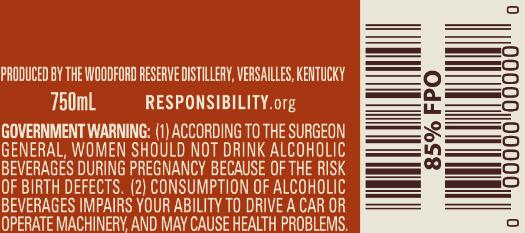
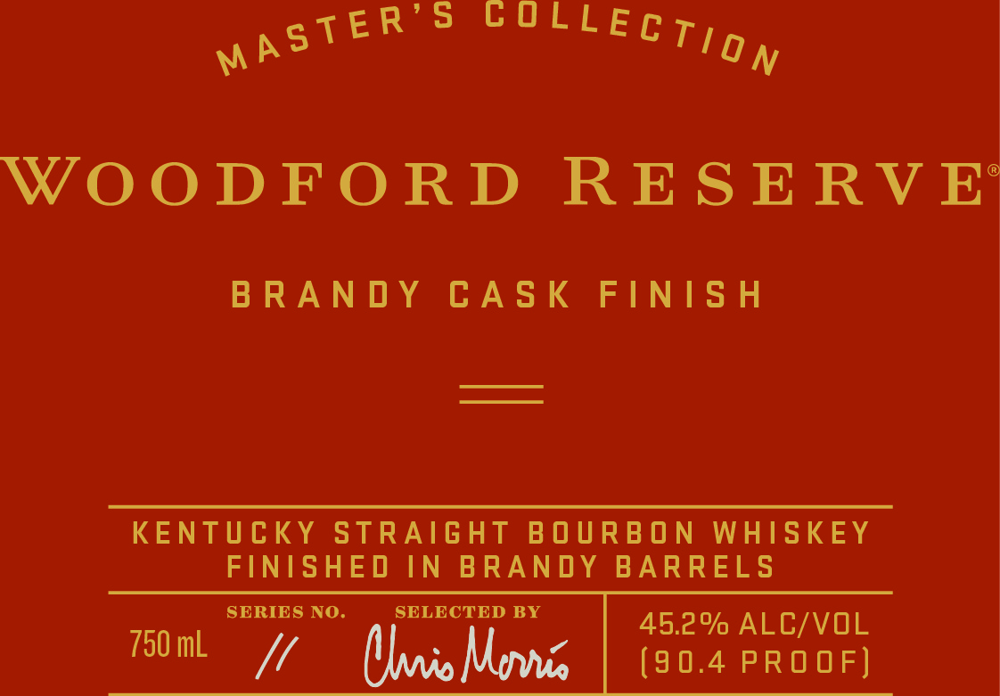
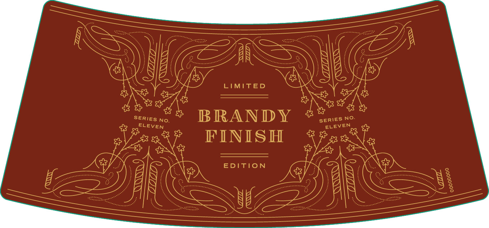

# TTB COLA Label Images - TTBID 16123001000240

**Brand Name:** WOODFORD RESERVE

**Fanciful Name:** MASTER'S COLLECTION BRANDY FINISH

**Issue Date:** 06/27/2016

**Origin Code:** 22

**Product Class/Type:** 641

**Source:** [TTB Public COLA Registry](https://ttbonline.gov/colasonline/viewColaDetails.do?action=publicFormDisplay&ttbid=16123001000240)

## Label Images

### Back Label

### Front Label

### Label 2

### Label 3

## Extracted Label Text

*Text extracted via OCR - may contain errors*

### Back Label

——————

PRODUCED BY THE WOODFORD RESERVE DISTILLERY, VERSAILLES, KENTUCKY

750mL

RESPONSIBILITY. org

GOVERNMENT WARNING: (1) ACCORDING T0 THE SURGEON

GENERAL, WOMEN SHOULD NOT DRINK ALCOHOLIC

BEVERAGES DURING PREGNANCY BECAUSE OF THE RISK

——

1)

M———=5

OF BIRTH DEFECTS. (2) CONSUMPTION OF ALCOHOLIC

BEVERAGES IMPAIRS YOUR ABILITY T0 DRIVE A CAR OR

—

OPERATE MACHINERY AND MAY CAUSE HEALTH PROBLEMS.

### Front Label

WOODFORD RESERVE

BRANDY CASK FINISH

KENTUCKY STRAIGHT BOURBON WHISKEY

FINISHED IN BRANDY BARRELS

SERIES NO.

SELECTED BY

¢

45.2% ALC/VOL

750 mL VA 5

(90.4 PROOF)

### Label 2

The art of making fine spirits first took place on the site of the

00000000

Woodford Reserve Distillery, a National Historic Landmark, in 1812.

### Label 3

‘i

ri

LIMITED

i

SERIES No.

ELEVEN

BRANDY

FINISH

SERIES NO

ELEVEN

EDITION

i

us

ie
