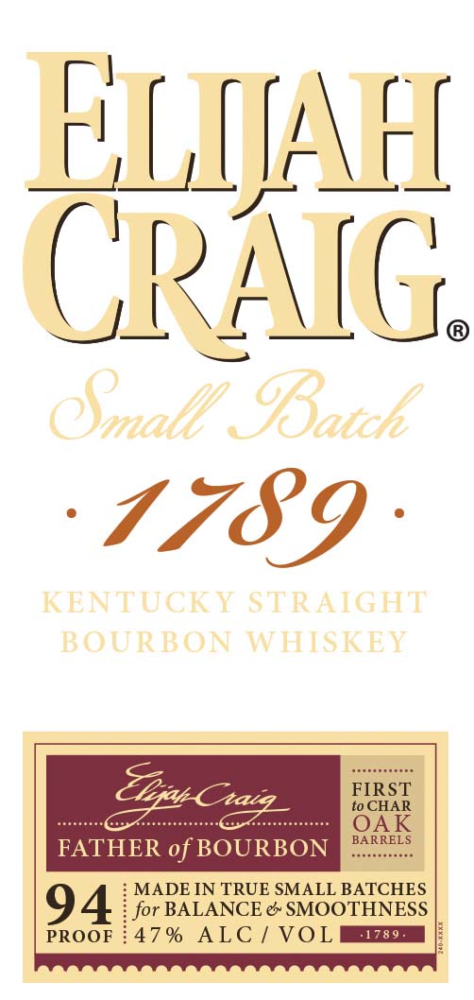
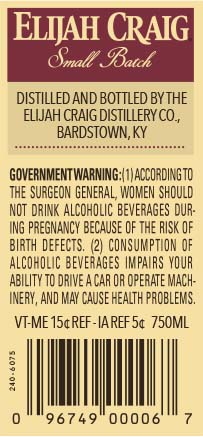

# TTB COLA Label Images - TTBID 16141001000057

**Brand Name:** ELIJAH CRAIG

**Fanciful Name:** SMALL BATCH 1789

**Issue Date:** 06/17/2016

**Origin Code:** 22

**Product Class/Type:** 101

**Source:** [TTB Public COLA Registry](https://ttbonline.gov/colasonline/viewColaDetails.do?action=publicFormDisplay&ttbid=16141001000057)

## Label Images

### Label 1

### Label 2

## Extracted Label Text

*Text extracted via OCR - may contain errors*

**Detected Proof:** 94

### Label 1

ELIAFL
CRAIG
Oallp 9Batch
1789
KENTUCKT STRAIGHT
BOURBON WHISKEY
FIRST
to CHAR
OAK
BARRELS
FATHER of BOURBON
MADE IN TRUE SMALL BATCHES
94
for BALANCE & SMOOTHNESS
PROOF
47 %
ALC
VOL
.1789 .
Uvatc
Cxaiq

### Label 2

ELIJAH CRAIG

Sinall

Mate

DISTILLED AND BOTTLED BY THE

ELWAH CRAIG DISTILLERY CO,

‘BARDSTOWN, KY

GOVERNMENTWARNING:|1) ACCORDINGTO

THE SURGEON GENERAL, WOMEN SHOULD

NOT DRINK ALCOHOLIC BEVERAGES DUR-

ING PREGNANCY BECAUSE OF THE RISK OF

BIRTH DEFECTS. (2) CONSUMPTION OF

ALCOHOLIC BEVERAGES IMPAIRS YOUR

ABILITY TO DRIVE ACAR OR OPERATE MACH-

INERY, AND MAY CAUSE HEALTH PROBLEMS.

VEME 15¢REF-IAREF 5¢ 750ML

MI),
