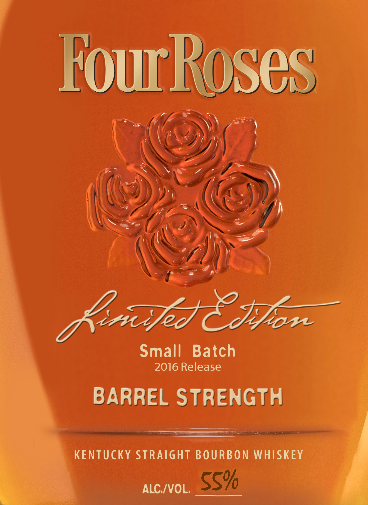
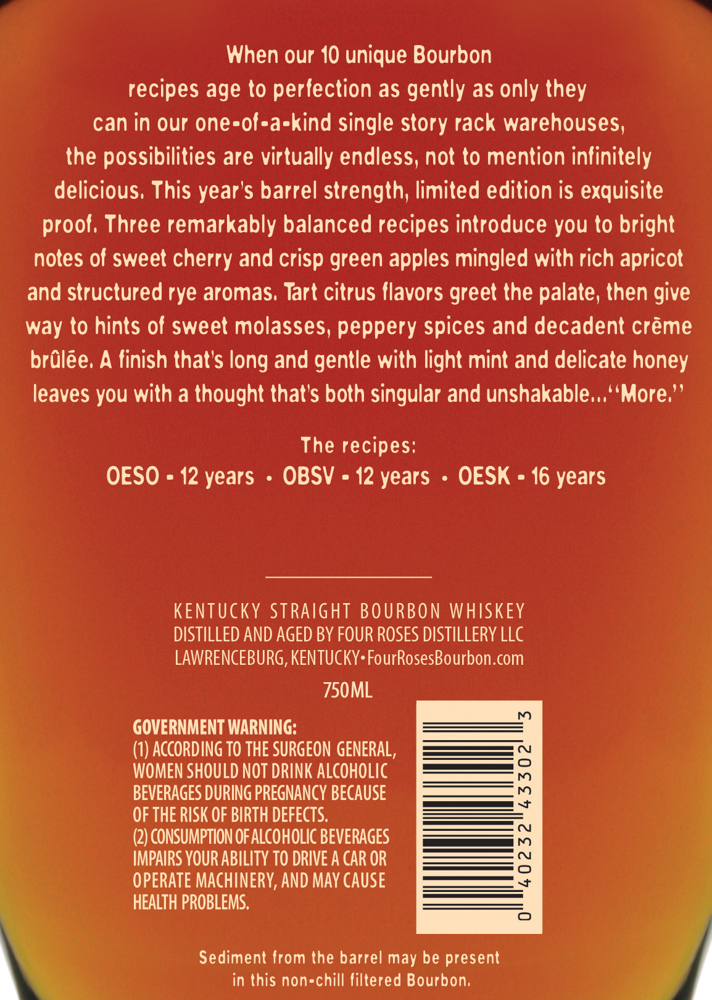
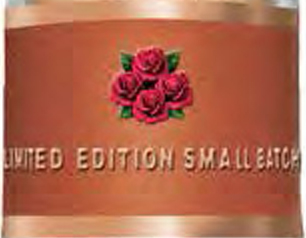

# TTB COLA Label Images - TTBID 16144001000532

**Brand Name:** FOUR ROSES

**Fanciful Name:** LIMITED EDITION SMALL BATCH

**Issue Date:** 06/21/2016

**Origin Code:** 22

**Product Class/Type:** 101

**Source:** [TTB Public COLA Registry](https://ttbonline.gov/colasonline/viewColaDetails.do?action=publicFormDisplay&ttbid=16144001000532)

## Label Images

### Label 1

### Label 2

### Label 3

## Extracted Label Text

*Text extracted via OCR - may contain errors*

*1 image(s) excluded: text did not meet readability threshold*

### Label 1

Small Batch
2016 Release

BARREL STRENGTH

KENTUCKY STRAIGHT BOURBON WHISKEY — ae

ALC/VOL. SS%

### Label 2

When our 10 unique Bourbon

recipes age to perfection as gently as only they

can in our one-of-a-kind single story rack warehouses,

the possibilities are virtually endless, not to mention infinitely

delicious. This year’s barrel strength, limited edition is exquisite

proof. Three remarkably balanced recipes introduce you to bright

notes of sweet cherry and crisp green apples mingled with rich apricot

and structured rye aromas. Tart citrus flavors greet the palate, then give

way to hints of sweet molasses, peppery spices and decadent créme

brdlée, A finish that's long and gentle with light mint and delicate honey

leaves you with a thought that’s both singular and unshakable...‘‘More.”’

The recipes:

OESO = 12 years - OBSV = 12 years - OESK = 16 years

KENTUCKY STRAIGHT BOURBON WHISKEY

DISTILLED AND AGED BY FOUR ROSES DISTILLERY LLC

LAWRENCEBURG, KENTUCKY: FourRosesBourbon.com

750ML

GOVERNMENT WARNING:

(1) ACCORDING TO THE SURGEON GENERAL,

WOMEN SHOULD NOT DRINK ALCOHOLIC

a O

BEVERAGES DURING PREGNANCY BECAUSE

OF THE RISK OF BIRTH DEFECTS.

—Es

(2) CONSUMPTION OF ALCOHOLIC BEVERAGES

ee

IMPAIRS YOUR ABILITY TO DRIVE A CAR OR

OPERATE MACHINERY, AND MAY CAUSE

HEALTH PROBLEMS.

Sediment from the barrel may be present

in this non-chill filtered Bourbon,
