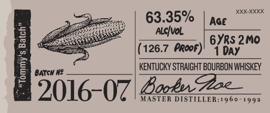
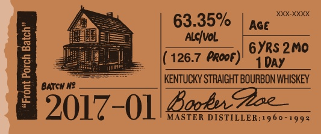
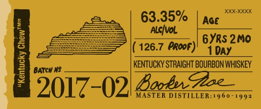
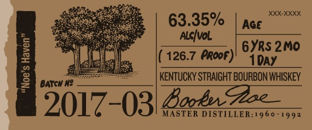
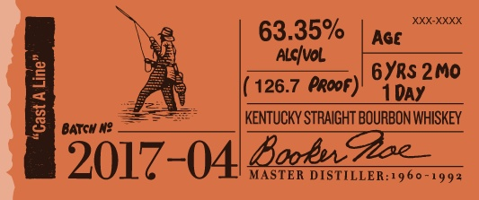
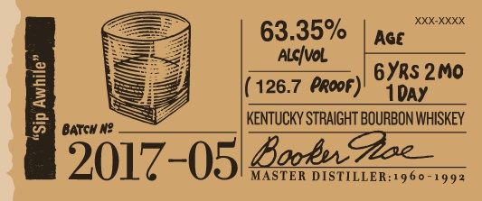

# TTB COLA Label Images - TTBID 16161001000043

**Brand Name:** BOOKER'S

**Fanciful Name:**  

**Issue Date:** 07/06/2016

**Origin Code:** 22

**Product Class/Type:** 101

**Source:** [TTB Public COLA Registry](https://ttbonline.gov/colasonline/viewColaDetails.do?action=publicFormDisplay&ttbid=16161001000043)

## Label Images

### Label 1

### Label 2

### Label 3

### Label 4

### Label 5

### Label 6

### Label 7

### Label 8

### Label 9

## Extracted Label Text

*Text extracted via OCR - may contain errors*

*4 image(s) excluded: text did not meet readability threshold*

### Label 1

booker

Bho Wibuy tm shea frchege Ae

(es

mila

Satta sper tds ur fll

Wy rm o lin Loan bh his

eee, || == |

PEN LES epens

s<¢e

barrel tured.

cened jlo .

### Label 4

E as 63.35% AGE __
! (oar m T
ES ace KENTUCKY STRAIGHT BOURBON WHISKEY

2017 ()2| Beebe Zee

### Label 5

REE | 63.35% | nce"
Ree ALC/VoL
See Fame ineae ORS eNO.
5 dat, (126.7 rooF)! 7 pay
E jen __| KENTUCKYSTRAIGHT BOURBON WHISKEY

2017-03 MASTER DISTILLER:1960-1992

### Label 6

8 63.35% Jace
. bs Ale|vol {Sans
2 =, ORF Doar\| OYRS 2M0

= Le R (126.7 PROOF)’ 4 pay
SD sarc KENTUCKY STRAIGHT BOURBON WHISKEY
2017-04 MASTER DISTILLER:1960-1992

### Label 7

63.35%

(126.7 @RooF)

1DAyY

Rondinc BOURBON WHISKEY

3017- -0)5| Borde MASTER DISTILLER:1960-1992
