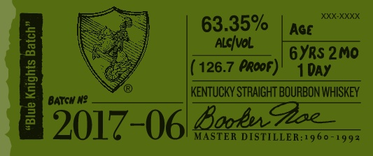
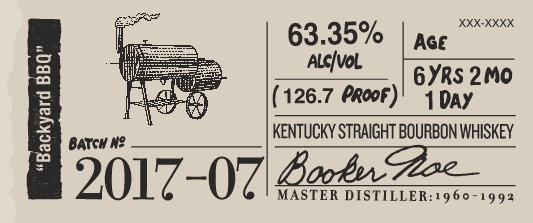

# TTB COLA Label Images - TTBID 16161001000044

**Brand Name:** BOOKER'S

**Fanciful Name:**  

**Issue Date:** 07/06/2016

**Origin Code:** 22

**Product Class/Type:** 101

**Source:** [TTB Public COLA Registry](https://ttbonline.gov/colasonline/viewColaDetails.do?action=publicFormDisplay&ttbid=16161001000044)

## Label Images

### Label 1

### Label 2

### Label 3

### Label 4

### Label 5

## Extracted Label Text

*Text extracted via OCR - may contain errors*

*1 image(s) excluded: text did not meet readability threshold*

**Detected Proof:** 126.7
**Detected Age:** 6 Years

### Label 1

XXX-XXXX
63.35%
Aqe
3
AlcIval
6YRs 2Mo
126.7 PRooF)
1 DAY
4
BatGH N?
KENTUuCKY STRAIGHT BOURBON WHISKEY
2017-061 8o.g@zz
MASTER DISTILLER:1960 -
992

### Label 2

5 i 63.35% | pace
ee | _ __ ayes ono
= Cughey (126.7 Proot)' 4 pay
2 KENTUCKY STRAIGHT BOURBON WHISKEY
2 Boob. Hoe
2017-07 MASTER DISTILLER:1960-1992

### Label 3

booker

Bho Wibuy tm shea frchege Ae

(es

mila

Satta sper tds ur fll

Wy rm o lin Loan bh his

eee, || == |

PEN LES epens

s<¢e

barrel tured.

cened jlo .

### Label 4

BOOKER'Se KENTUCKY STRAIGHT BOURBON WHISKEY
DISTILLED AND BOTTLED BY JAMES B. BEAM DISTILLING CO_
CLERMONT, KENTUCKY
GOVERNMENT WARNING: C
ACCORDIHG TO
THE   SURGEOH  GENERAL, WOMEN   ShOuLI
NOT DRNKALCOHOLIC BEVERAGES DUFIG
PREGHANCY
BECAUSE
OF
THE
RISK
OF BIRTH defects. (2| COMSUMPTLON OF
AlCOhOlC BEVERAGES   IMPAIRS  YOUR
abiLty TO DRIVE A CAR OR OPERATE MAChI:
ERK, AND  MAY  CAUSE  health  PROBLEMS ,
80686"01140'
ME VT REF [Sc + IA REF Sc
124-2455-A
