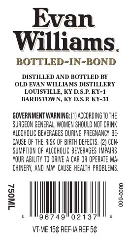
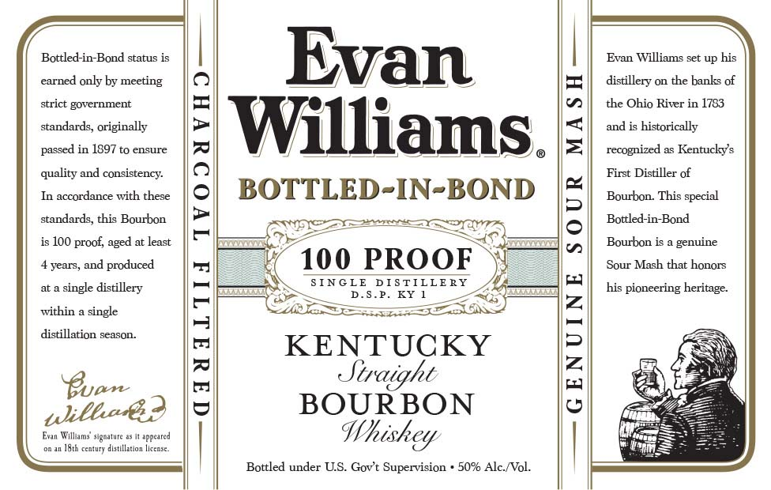
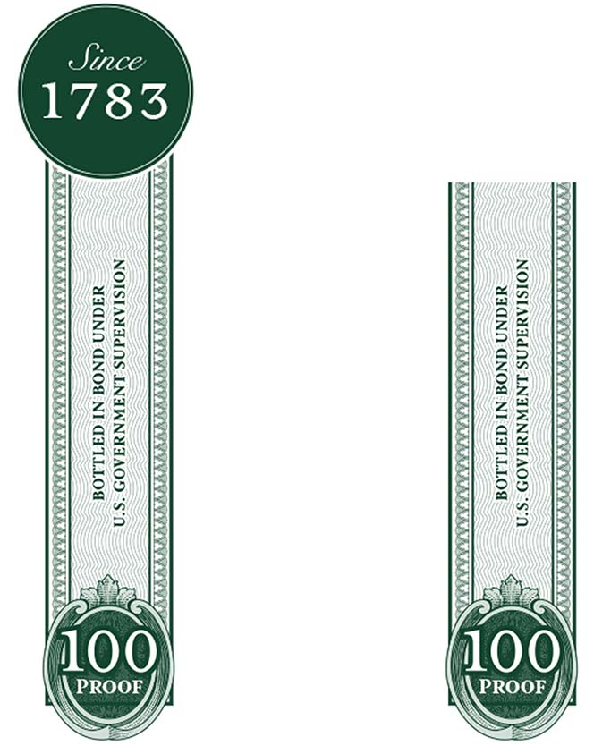

# TTB COLA Label Images - TTBID 16180001000393

**Brand Name:** EVAN WILLIAMS

**Fanciful Name:** BOTTLED-IN-BOND

**Issue Date:** 07/20/2016

**Origin Code:** 22

**Product Class/Type:** 101

**Source:** [TTB Public COLA Registry](https://ttbonline.gov/colasonline/viewColaDetails.do?action=publicFormDisplay&ttbid=16180001000393)

## Label Images

### Back Label

### Label 1

### Label 3

## Extracted Label Text

*Text extracted via OCR - may contain errors*

**Detected Proof:** 100
**Detected Age:** 4 Years

### Back Label

Evan
Williams
BOTTLED-IN-BOND
DISTILLED AND BOTTLED BY
OLD EVAN WILLIAMS DISTILLERY
LOUISVILLE KY DSP KY-1
BARDSTOWN, KY D.SP KY-31
GOVERNMENT WARMING;: | V| ACCORDINGTOTHE
SURGEON GENERAL, WOMEN SHOULD NOT DRINK
ALCOHOLIC BEVERAGES DURING PREGMANCY BE:
CauSE OF THE RUSK OF BIRTH DEFECTS. (24 CON:
SUMPTION oF ALCOHOLIC beverages VMPAIRS
YDUR ABILITY T0 DAIE
CAR QR OPERATE MA:
ChINERK AND  Kay  CauSE health PROBLEMS.
1
1
9 6 7 4 9
02137
VT-ME 15c REF-IA REF 5C

### Label 1

Bottled-in-Bond status is
Evan
Evan Williams set up his
earned only by meeting
distillery on the banks of
strict government
the Ohio River in 1783
standards, originally
Williams ||
and is historically
passed in 1897 t0 ensure
recognized
Kentucky s
quality and consistency:
1
First Distiller of
In accordance with these
BOTTLED-IN-BOND
Bourbon_
This special
standards, this Bourbon
{
Bottled-in-Bond
is 10O proof; aged at least
Bourbon is
genuine
4 years, and produced
7
100 PROOF
Sour Mash that
single distillery
SIN GLE
D IS TILLERY
his pioneering heritage
D . S.P_
KY
within
single
distillation season_
Buan
1
KENTUCKY
1
shleaec?
BOURBON
Evan Walliams' signature
Whiskgy
I8t6 centuiy distillation
Bottled under U.S. Govt Supervision
50% AlcNol:
bonors
"Fpeated
Liccex -

### Label 3

NOISIAUAdNS LNAWNUFAOD ‘S"0
UHGNN GNO@ NI GATLLOG

NOISIAWAdNS LNAWNUFAOD “S01

YAGNA GNO@ NI GATLLOG
