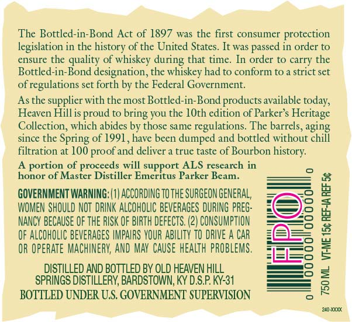
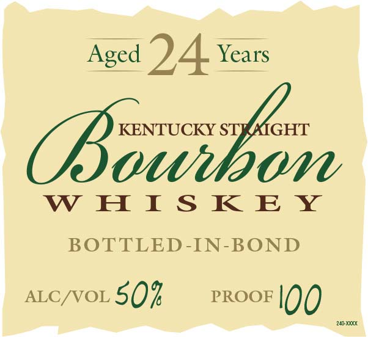

# TTB COLA Label Images - TTBID 16182001000337

**Brand Name:** PARKER'S HERITAGE COLLECTION

**Fanciful Name:** 24 YEAR

**Issue Date:** 07/25/2016

**Origin Code:** 22

**Product Class/Type:** 101

**Source:** [TTB Public COLA Registry](https://ttbonline.gov/colasonline/viewColaDetails.do?action=publicFormDisplay&ttbid=16182001000337)

## Label Images

### Back Label

### Label 1

## Extracted Label Text

*Text extracted via OCR - may contain errors*

**Detected Proof:** 100
**Detected Age:** 2.4 Years

### Back Label

The Bottled-in-Bond Act of 1897 was the first consumer protection

legislation in the history of the United States. It was passed in order to

ensure the quality of whiskey during that time. In order to carry the

Bottled-in-Bond designation, the whiskey had to conform to a strict set

of regulations set forth by the Federal Government.

Asthe supplier with the most Bottled-in-Bond products available today,

Heaven Hillis proud to bring you the 10th edition of Parker’s Heritage

Collection, which abides by those same regulations. The barrels, aging

since the Spring of 1991, have been dumped and bottled without chill

filtration at 100 proof and deliver a true taste of Bourbon history.

rt ALS research in

A portion of proceeds will supy

honor of Master Distiller Emeritus Parker Beam.

GOVERNMENT WARNING: (1) ACCORDING TO THE SURGEON GENERAL,

t=)

WOMEN SHOULD NOT DRINK ALCOHOLIC BEVERAGES DURING PREG:

NANCY BECAUSE OF THE RISK OF BIRTH DEFECTS. (2) CONSUMPTION

ao

OF ALCOHOLIC BEVERAGES IMPAIRS YOUR ABILITY 10 DRIVE A CAR

OR OPERATE MACHINERY, AND MAY CAUSE HEALTH PROBLEMS

DISTILLED AND BOTTLED BY OLD HEAVEN HILL

—O

SPRINGS DISTILLERY, BARDSTOWN, KY D.S.P. KY-31

-——}

BOTTLED UNDER U.S. GOVERNMENT SUPERVISION

20x00

### Label 1

Aged 2.4 Year
Seale
WHISKEY
BOTTLED-IN-BOND
ALC/VOL5Q% PROOF 100
