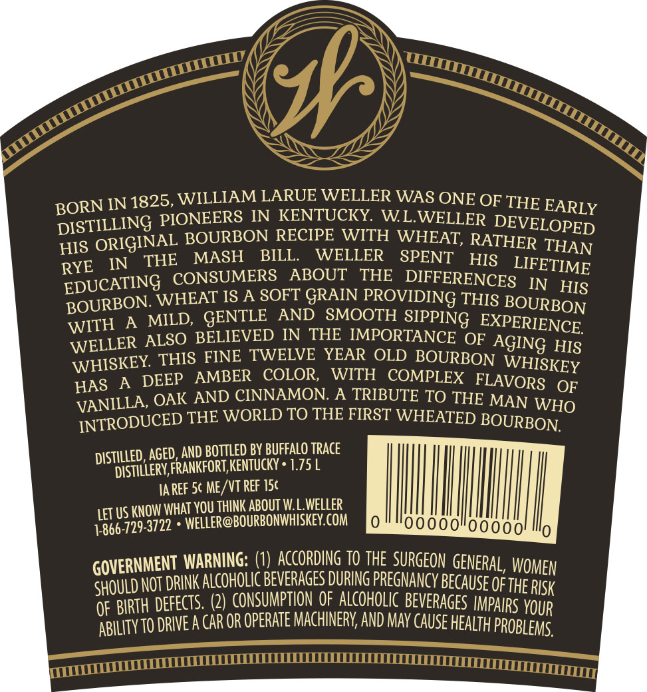
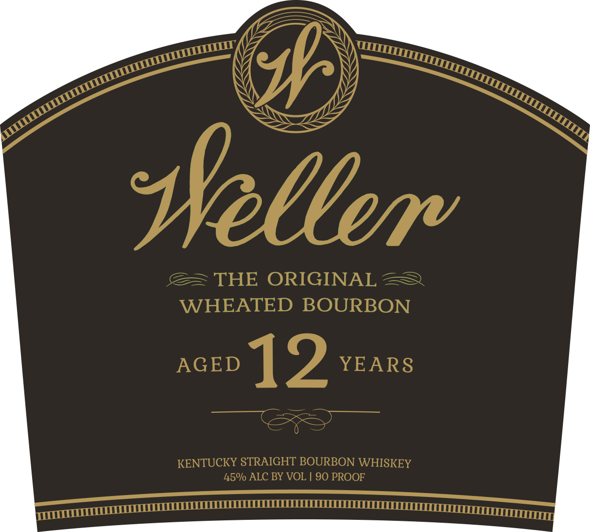

# TTB COLA Label Images - TTBID 16232001000349

**Brand Name:** WELLER

**Fanciful Name:**  

**Issue Date:** 08/28/2016

**Origin Code:** 22

**Product Class/Type:** 101

**Source:** [TTB Public COLA Registry](https://ttbonline.gov/colasonline/viewColaDetails.do?action=publicFormDisplay&ttbid=16232001000349)

## Label Images

### Back Label

### Label 1

## Extracted Label Text

*Text extracted via OCR - may contain errors*

**Detected Proof:** 90
**Detected Age:** 12 Years

### Back Label

IN 1825,WILLIAM LARUETWELLER WAS ONE OF THE EARLY
DISTILLING PIONEERS IN KENTUCKY WWLWELLER DEVELOPED
HIS ORIGINAL BOURBON RECIPEEWITH WHEAT; RATHER THAN
IN
THE
MASH
BILL.
WELLER
SPENT
HIS _ LIFETIME
EDUCATING CONSUMERS
ABOUT
THE
DIFFERENCES
IN
HIS
BOURBON WHEAT ISA SOFNGRAYPROVIDJNG THIS BOURBON
WITH
A
MILD, GENTLE
AND HMOOTH SIPPING  EXPERIENCE
WELLER ALSO BELIEVED EN
THE IMPORTANCE OF
THIS FINE TWELVE YEAR OLD BOURBON
HIS
WHSSKEY
DEEP   AMBER
COLOR,
WITHO COMPLRBOMAVORISKOF
OF
VANILLA; OAK AND CINNAMON
A
FTRIBUTE TO THE MAN WHO
INTRODUCED THE WORLD TO THE FIRST WHEATED BOURBON
AGED,
BOTTLED BY BUFFALO TRACE
DiStillery,FRANKFoRT KentucKY
1.75
IA REF 5c ME /VT REF I5c
LET US KNOW WhAt YoU Think ABOUT WL Weller ,
1-866-729-3722
WELLER@BOURBONWHISKEY.COM
GOVERNMENT WARNING: (#)caccordang jo THEcsurGeon GeNERAL, WOMEN
SHould NOT DrIK alcoholic BeveRAGES DURING PREGNANCY Because OfthE RISk
OF BIRTH Defects: (2) CONSUMPTION Oe falcoholicBeVeRAGES IMpalrs YOUR
TO DRIEa CAR OR operate MAchInERV; AND May CAuSe Health PRoBleMs.
BORN
RYE
AGING
HAS
AND
DISTILLED ,
ABILITy T

### Label 1

seleere
THE ORIGINAL
WHEATED BOURBON
AGED
12
YEARS
KENTUCKY STRAIGHT BOURBON WHISKEY
45%/ ALC BY VOL
90 PROOF
