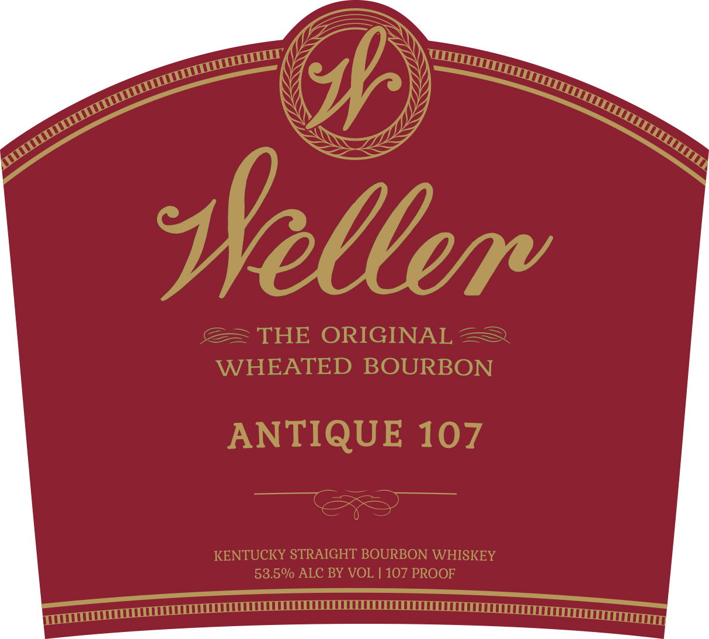
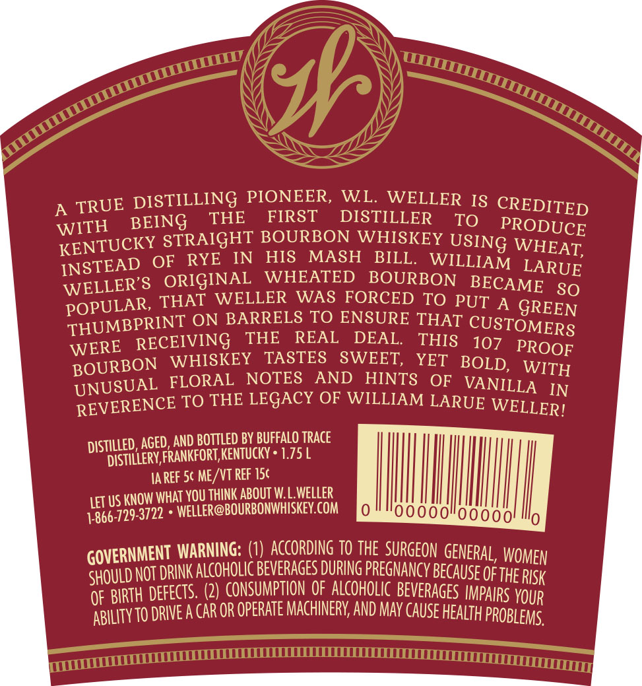

# TTB COLA Label Images - TTBID 16232001000351

**Brand Name:** WELLER

**Fanciful Name:**  

**Issue Date:** 08/28/2016

**Origin Code:** 22

**Product Class/Type:** 141

**Source:** [TTB Public COLA Registry](https://ttbonline.gov/colasonline/viewColaDetails.do?action=publicFormDisplay&ttbid=16232001000351)

## Label Images

### Label 1

### Label 2

## Extracted Label Text

*Text extracted via OCR - may contain errors*

### Label 1

Seth

7

uul

sre

SS

\(

ss

wy

ae,

sy

>

Sy

Wellem

CE

THE ORIGINAL 2

WHEATED BOURBON

ANTIQUE 107

KENTUCKY STRAIGHT BOURBON WHISKEY

52 50

53.5%

» ALC BY VOL | 107 PROOF

a mUTTTTUTUTUUUUUTULLLEOLELLLLLLLL EEE caLLLUULU nt ee

### Label 2

yf

A TRUE DISTI

LLING PIONEER, WL. WELLER Ig c

REDITED

Ww

ITH BEING THE

FIRST DISTILLER TO

PRODUCE

KENTUCK

Y STRAIGHT BOURBON WHISKEY USIN

G WHEAT,

INSTEAD

OF RYE IN HIS MASH BILL. WILLIA

ORIGINAL WHEATED BOURBON BE

M LARUE

W

ELLER’S

CAME so

POP

“SLAR, THAT WELLER WAS FORCED TO PUT

A GREEN

THUMB

PRINT ON BARRELS TO ENSURE THAT Cu:

STOMERS

WERE REC

EIVING THE REAL DEAL. THIS 19

7 PROOF

BOURBON WHISKEY TASTES SWEET, YET BOLD, WITH

UNUSUAL FLORAL

OTES AND HINTS OF VAN]

LLA IN

REVERENCE TO THE LEGACY OF WILLIAM LARUE

WELLER!

DISTILLED,

AGED, AND BOTTLED BY BUFFALO TRACE

DISTILLERY,

FRANKFORT, KENTUCKY 1.75 L

IAREF 5¢ ME/VT REF 15¢

OW WHAT YOU THINK ABOUT W. L.WELLER

1-866-729-

LET US KN

3722 » WELLER@BOURBONWHISKEY.COM

0

0000

Nh

0"00000! Mo

GOVERNMENT WARNING: (1) ACCORDING TO THE SURGEON GENERAL, WOMEN

SHOULD NOT

DRINK ALCOHOLIC BEVERAGES DURING PREGNANCY BECAUSE OF THE Ris

OF BIRTH DEFECTS. (2)

CONSUMPTION OF ALCOHOLIC BEVERAGES IMPAIRS YOUR

ABILITY TO DRIVE A CAR OR OPERATE MACHINERY, AND MAY CAUSE HEALTH PROBLEMS,

———=———————
