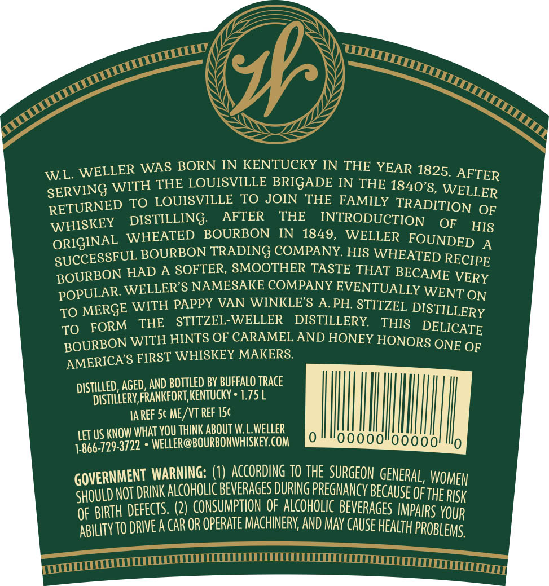
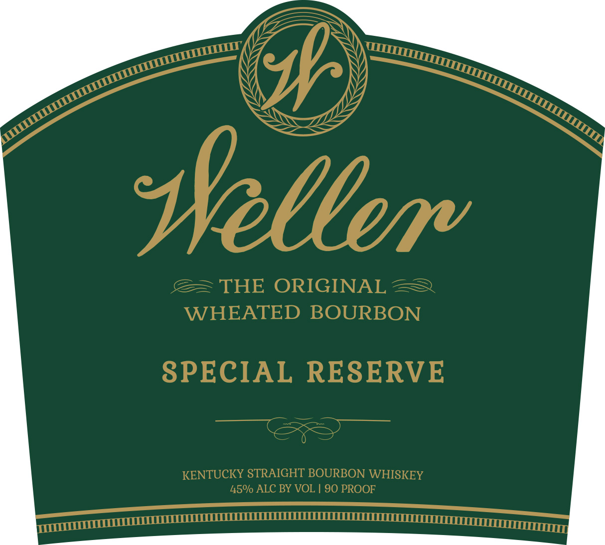

# TTB COLA Label Images - TTBID 16232001000355

**Brand Name:** WELLER

**Fanciful Name:**  

**Issue Date:** 08/28/2016

**Origin Code:** 22

**Product Class/Type:** 101

**Source:** [TTB Public COLA Registry](https://ttbonline.gov/colasonline/viewColaDetails.do?action=publicFormDisplay&ttbid=16232001000355)

## Label Images

### Back Label

### Label 1

## Extracted Label Text

*Text extracted via OCR - may contain errors*

**Detected Proof:** 90

### Back Label

WELLER WAS BORN IN KENTUCKY IN THE YEAR 1825.
WL_
WITH THE LOUISVILLE BRIGADE IN THE 1840*8,
SERVING
TO LOUISVILLE TO JOIN
THE FAMILY ISRADITIONLOR
RETURNED DOSTIOUING
AFTER
THE
INTRODUCTION
OF
WHISKEY
OF
HIS
WHEATED
BOURBON
IN
1849,
WELLER_FOUNDED
ORIGINAL
BOURBON TRADING COMPANY. HIS WHEATED
A
BOCRBGRUELAOUREONERAMOOTHOER PAAST HS NHETEDR [CRE
BOUULON WADLERONHESAKE COMPANSEVENIUABEC
VERY
POPULAR
WITH PAPPY VAN WINKLE'8 A PH STITZEL
MERGE
THE
STITZEL-WELLER
DISTILLERY
THIS
DISTILLERY
TOURcoN WHE HNTZOF CARAMELAND HONFY HONORBONC OF
OF
AMERICA 8 FIRST WHISKEY MAKERS
DISTILLED, AGED; AND BOTTLED BY BUFFALO TRAce
diStillery,FRankfoRT, KenTucky
1.75 L
IA REF Sc ME /VT REF I5c
LET US KNOW WHAt YoU ThInK ABOUT WLWELLER
-729-3722
WELLer@BOURBONWHISKEY.COM
GOVERNMENT WARNING: (#DEAccoRDyNG PO THECSURGeon GENERAL, WOMEN
Should NOT DrIK alcoholic BeveRAGES DURING PregNancy BECAUSE OF the RISk
OF BIRTH defects. (2) CONSUMPTION Oe enlcoholic Beverages IMpars Your
'T0 DrIEa caR OR opeRATe MAchnery; AND May cause health probleMs.
AFTER
WENT
ON
TO
FORM
TO
ONE
1-866-
ABILITy 1

### Label 1

seller
THE ORIGINAL
WHEATED BOURBON
SPECIAL RESERVE
KENTUCKY STRAIGHT BOURBON WHISKEY
45% ALC BY VOL
90 PROOF
