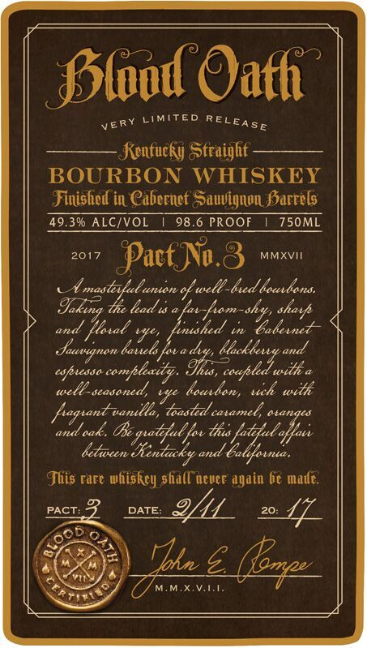
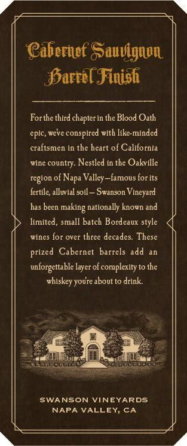
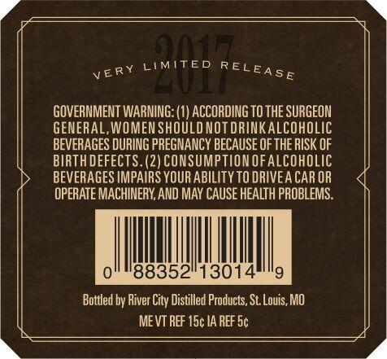
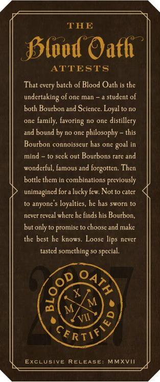

# TTB COLA Label Images - TTBID 16286001000281

**Brand Name:** BLOOD OATH

**Issue Date:** 11/23/2016

**Origin Code:** 29

**Product Class/Type:** 641

**Source:** [TTB Public COLA Registry](https://ttbonline.gov/colasonline/viewColaDetails.do?action=publicFormDisplay&ttbid=16286001000281)

## Label Images

### Label 1

### Label 2

### Label 3

### Label 4

### Label 5

### Label 6

## Extracted Label Text

*Text extracted via OCR - may contain errors*

*1 image(s) excluded: text did not meet readability threshold*

**Detected Proof:** 98.6

### Label 1

Sslod Oafh '
LIMITED
Kentucky Straighf-
BOURBON WHISKEY
Finished in Cabernet SSauvignon SSarrels
49.39 ALCIVOL
98.6 PROOF
750ML
2017
PactNu.8
MMXVII
maslefulunton % wele_bxed touxdons
tie &ead %
and
"skdmsha_tahavt
lushed
laueld fva dvy,
and
comfleaey. Ius ,
Ia
welbl-seedened % loedon;
ttk
pagtant-vanella ,
toasted catamel, atanqes
'vak, Be gatful fov ths {atetul affaei
letwcen
and Za
This rare whiskey shall ncvcr again b€ made:
PACT:
2
DATE:
20:
L
Tbun 5
RELEASE
'ERY
9h16
shatf
Jaetgnon
eopiessa
uct
ad ,
"Kentacky
(ocp

### Label 2

@abernef SSauvignpn
Sarrel Finish
Forthethird chapter In the Blood Oath
eptc, weve consplred wtth
minded
craftsmen in the heart of California
wlne country Nestled In the Oakville
reglon of )
Valley-famous for Its
fertile; alluvlal soll
Swanson Vineyard
has been
natlonally known and
limited ; small batch Bordeaux style
wines for over three decades: These
prized  Cabernet barrels add
unforgettable layer of complexity to the
youre about to drlak:
SWANSON VINEYARDS
NAPA VALLEY, CA
Jike
Napa
making "
hiskey

### Label 3

Ct
LIMITED
(
GOVERNMENT WARNING: (1) ACCORDING TO THE SURGEON
GENERAL,WOMEN SHOULD NOT DRINKAlcOhOLIC
BEVERAGES DURING PREGNANCY BECAUSE OF THE RISK OF
BIRTHDEFECTS.(2) CONSUMPTION OFALcOHOLIC
BEVERAGES IMPAIRS YOUR ABILITY TO DRIVEA CAR OR
OPERATE MACHINERY,AND MAY CAUSE HEALTH PROBLEMS.
88352/13014
Bottled by
City Distilled Products; St Louis, MO
ME VT REF 15c IA REF Sc
RELEASE
VERY
 River '

### Label 4

TTHE
Sled Oath
ATTESTS
every batch of Blood Oath is the
undertaking of one man
student o
both Bourbon and Science Loyal to no
OIlE
family; favoring no one
distillery
and bound by IO one
'philosophy - this
Bourbon connoisscur has one
mind
out Bourbons rare and
wonderful, famous and forgotten. Then
bottle them in combinations previously
unimagined for a lucky few Not to cater
anyone
loyalties, he has sworn to
never rcvcal where hc finds his Bourbon,
but only to promisc to choosc and makc
the best he knows. Loose lips never
tasted
something =
special,
6
M
CeRTIF
EXclusive RELEASE: MMxvii
That
goal
'scck
VII

### Label 6

VKRY LMITED RELEASE
NATER T0 BI MADE AGAL
