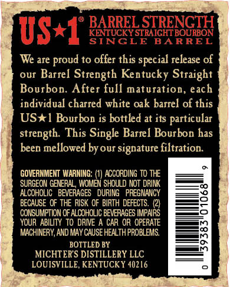
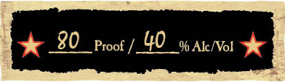
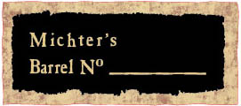
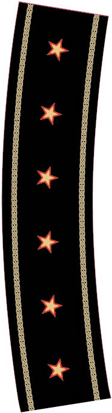
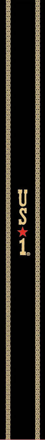

# TTB COLA Label Images - TTBID 17010001000238

**Brand Name:** MICHTER'S

**Fanciful Name:** LIMITED RELEASE - BARREL STRENGTH

**Issue Date:** 01/18/2017

**Origin Code:** 22

**Product Class/Type:** 101

**Source:** [TTB Public COLA Registry](https://ttbonline.gov/colasonline/viewColaDetails.do?action=publicFormDisplay&ttbid=17010001000238)

## Label Images

### Back Label

### Front Label

### Label 4

### Label 5

### Label 6

## Extracted Label Text

*Text extracted via OCR - may contain errors*

*4 image(s) excluded: text did not meet readability threshold*

### Back Label

BARREL STRENGTH
US*17
KENTUCKY STRAIGHT BOURBON
STNCLE
BARREL
We are proud to offer this special release of
OuI
Barrel Strength Kentucky Straight
Bourbon. After full maturation, each
individual charred white oak barrel of this
US*1 Bourbon is bottled at its particular
strength: This Single Barrel Bourbon has
been mellowed by our signature filtration:
GOVERNMEMT WARNING: (1] ACCORDING TO THE
SURGEON GENERAL , WOMEN SHOULD NOT DRINK
ALCOHOLIC   BEVERAGES   DURING   PREGNANCY
BECAUSE OF THE RISK OF BIRTH DEFECTS. (2)
CONSUMPTION OF ALCOHOLIC BEVERAGES IMPAIRS
YOUR ABILITY  TO DRIVE A CAR OR OPERATE
MACHINERY,AND MAY CAUSE HEALTH PROBLEMS
8
BOTTLED BY
MICHTERS DISTILLERY LLC
LOUISVILLE, KENTUCKY 40216
