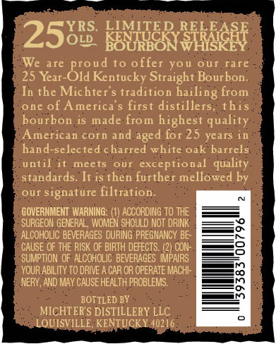
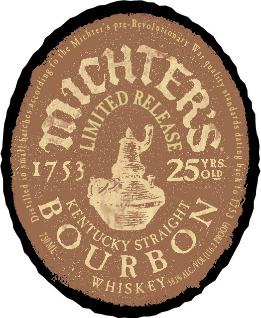
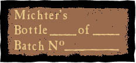

# TTB COLA Label Images - TTBID 17010001000369

**Brand Name:** MICHTER'S

**Fanciful Name:** LIMITED RELEASE - 25 YRS OLD

**Issue Date:** 01/18/2017

**Origin Code:** 22

**Product Class/Type:** 101

**Source:** [TTB Public COLA Registry](https://ttbonline.gov/colasonline/viewColaDetails.do?action=publicFormDisplay&ttbid=17010001000369)

## Label Images

### Back Label

### Front Label

### Label 2

## Extracted Label Text

*Text extracted via OCR - may contain errors*

*2 image(s) excluded: text did not meet readability threshold*

**Detected Age:** 25 Years

### Back Label

YRS. LIMITED REL BASE

25

OLD. BAY MNS PAGES HT

We are proud to offer you our rare

25 Year-Old Kentucky Straight Bourbon

In the Michter’s tradition hailing from

one of America’s first distillers, this

bourbon is made from highest quality

ars in

American corn and aged for 25

hand-selecte

charred white oak barrels

until it meets our exceptional qu:

standards. It is then further mellowed by

our signature filtration.

‘GOVERNMENT WARNING: (1) ACCORDING TO THE

SURGEON GENERAL, WOMEN SHOULD NOT DRINK

ALCOHOLIC BEVERAGES DURING PREGNANCY BE-

‘CAUSE OF THE RISK OF BIRTH DEFECTS. (2) CON-

SUMPTION OF ALCOHOLIC BEVERAGES IMPAIRS

‘YOUR ABILITY TO DRIVE A CAR OR OPERATE MACH

NERY, AND MAY CAUSE HEALTH PROBLEMS.

BOTTLED BY

MICHTER'S DISTILLERY LLC

OUISVILLE, KENTU!

¥ 40216
