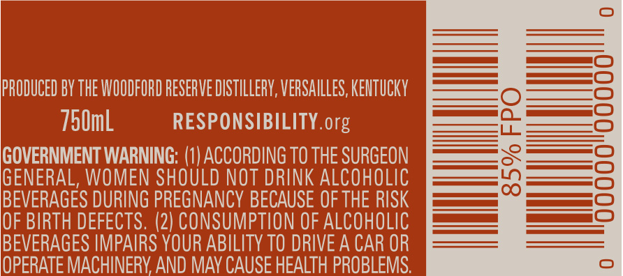
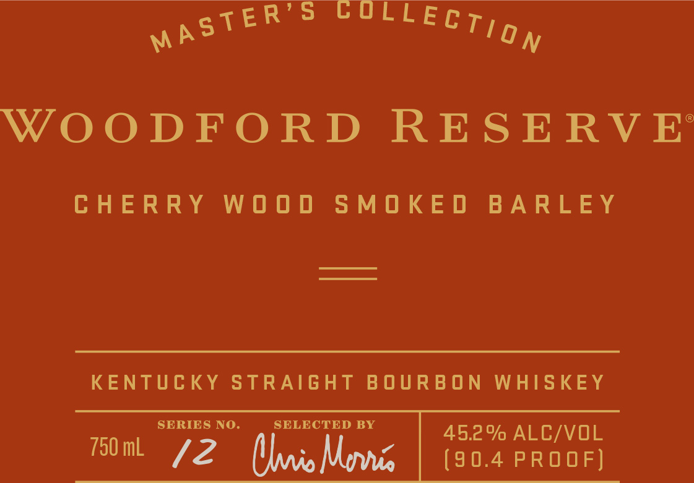
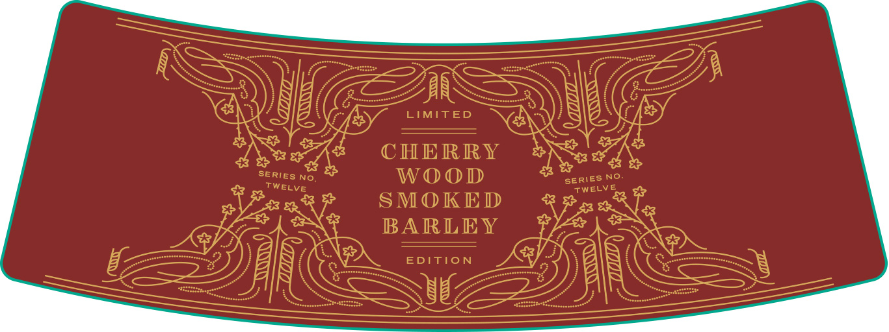

# TTB COLA Label Images - TTBID 17052001000374

**Brand Name:** WOODFORD RESERVE

**Fanciful Name:** CHERRY WOOD SMOKED BARLEY

**Issue Date:** 03/15/2017

**Origin Code:** 22

**Product Class/Type:** 101

**Source:** [TTB Public COLA Registry](https://ttbonline.gov/colasonline/viewColaDetails.do?action=publicFormDisplay&ttbid=17052001000374)

## Label Images

### Back Label

### Front Label

### Label 2

### Label 3

## Extracted Label Text

*Text extracted via OCR - may contain errors*

*1 image(s) excluded: text did not meet readability threshold*

### Back Label

PRODUCED BY THE WOODFORD RESERVE DISTILLERY, VERSAILLES, KENTUCKY
750mL RESPONSIBILITY. org

GOVERNMENT WARNING: (1) ACCORDING TO THE SURGEON
GENERAL, WOMEN SHOULD NOT DRINK ALCOHOLIC
BEVERAGES DURING PREGNANCY BECAUSE OF THE RISK
OF BIRTH DEFECTS. (2) CONSUMPTION OF ALCOHOLIC
BEVERAGES IMPAIRS YOUR ABILITY TO DRIVE A CAR OR
OPERATE MACHINERY. AND MAY CAUSE HEALTH PROBLEMS.

### Front Label

SoC eee

WOODFORD RESERVE

CHERRY WOOD SMOKED BARLEY

KENTUCKY STRAIGHT BOURBON WHISKEY

SERIES NO. SELECTED BY 45.2% ALC/VOL
som 72 MoM | (30.4 PROOF}

### Label 3

; TURMUORDUORUORUUORUUUNDOR DUCT OORT OTIUOT ROUTH OUR UOTOEDUUUT OCU RUORUURDONUNOUTUUUTORINOTU TOT ORIN OTROCT TOTO TOTONERDOT UU OTOTUTOORRNOTOUOTOOUTONTNOUTUOU ROOT O ORT OORT ORT OTe
The art of making fine whiskeys first took place on the site of the

Woodford Reserve Distillery, a National Historic Landmark, in 1812.

OURO MCGU ROR CO MUM OUCORPORURORUONCORCORUORNORNCOUUODURNMORUORMORRURURORUOD COUR CRUEURUONUOUNORURUROOUUONNORUROCORORONNORUGUMORUORDORNURUCORUGRUORNORURURUGNUODTOR NOOO Gm
