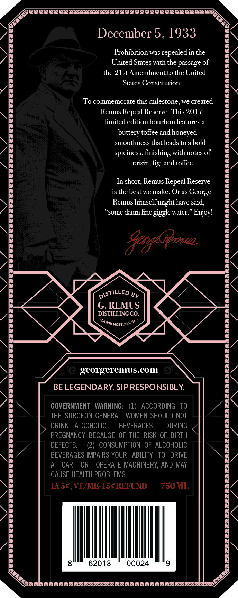
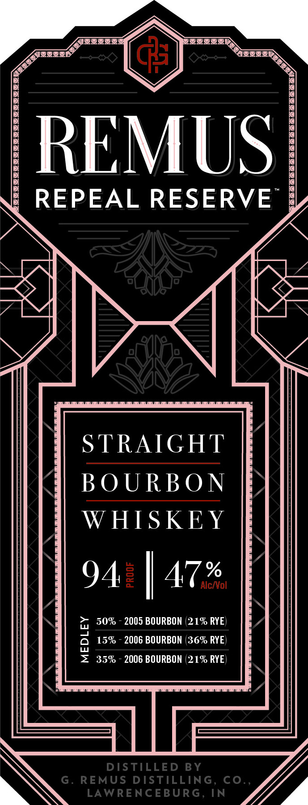

# TTB COLA Label Images - TTBID 17091001000011

**Brand Name:** REMUS REPEAL RESERVE

**Issue Date:** 04/10/2017

**Origin Code:** 22

**Product Class/Type:** 101

**Source:** [TTB Public COLA Registry](https://ttbonline.gov/colasonline/viewColaDetails.do?action=publicFormDisplay&ttbid=17091001000011)

## Label Images

### Back Label

### Front Label

### Label 3

### Label 4

## Extracted Label Text

*Text extracted via OCR - may contain errors*

### Back Label

\e"

__——_—__

Bi

December 5, 1933

AN

\\e

Prohibition was repealed in the

United States with the passage of

the 21st Amendment to the United

States Constitution.

To commemorate this milestone, we created

Remus Repeal Reserve. This 2017

\\i

limited edition bourbon features a

buttery toffee and honeyed

\\6

smoothness that leads to a bold

/\e

spiciness, finishing with notes of

\\

raisin, fig, and toffee.

In short, Remus Repeal Reserve

is the best we make. Or as George

Remus himself might have said,

“some damn fine giggle water.” Enjoy!

Ne

Ns

NSTILLED py

G. REMUS

DISTILLING CO.

4

Aimnencenure™

2

georgeremus.com

BE LEGENDARY. SIP RESPONSIBLY.

4

GOVERNMENT WARNING: (1) ACCORDING TO

THE SURGEON GENERAL, WOMEN SHOULD NOT

BEVERAGES

DURING

/Ne

5 DRINK ALCOHOLIC

PREGNANCY BECAUSE OF THE RISK OF BIRTH

DEFECTS.

(2) CONSUMPTION OF ALCOHOLIC

BEVERAGES IMPAIRS YOUR ABILITY TO DRIVE

A CAR OR OPERATE MACHINERY, AND MAY

CAUSE HEALTH PROBLEMS.

IA 5¢, VI/ME-15¢ REFUND

750ML

/\

il

8

62018

00024

|

Bi

\ EE TAEEAIEEIIEIEAIISALIAAESI ASAE tas

### Front Label

gin frees

_——

eo

REMUS

REPEAL RESERVE

NA

WWI

2 |

l <

7M]

IMTS

a

STRAIGHT

BOURBON

WHISKEY

A,

94 |

a 50% - 2005 BOURBON (21% RYE)

a 15% - 2006 BOURBON (36% RYE

= 35% - 2006 BOURBON (21% RYE

WN

Wf

### Label 3

KO

REPEAL

SERIES
