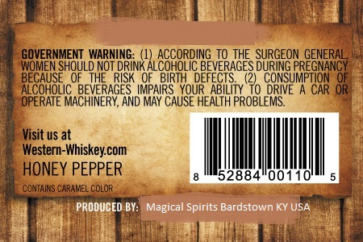
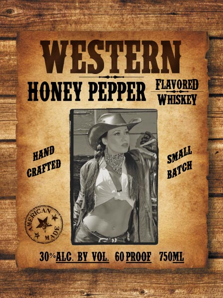

# TTB COLA Label Images - TTBID 17091001000043

**Brand Name:** WESTERN

**Issue Date:** 04/07/2017

**Origin Code:** 22

**Product Class/Type:** 149

**Source:** [TTB Public COLA Registry](https://ttbonline.gov/colasonline/viewColaDetails.do?action=publicFormDisplay&ttbid=17091001000043)

## Label Images

### Back Label

### Front Label

## Extracted Label Text

*Text extracted via OCR - may contain errors*

**Detected Proof:** 60

### Back Label

GOVERNMENT  WARNING:
ACCORDING To THE  SURGEON GENERAL
WOMEN
SSHouloioteSnoflGoroEtGeeveRSGE3 DConst
"UoNSURRpGornaf
BECAUSE
RISK ' OF  BIRTH
ALcoHoLic
JGAEeHERGER
IMPAIRS  YOUR ABILi
DRIVE
CAR OR
OPERATE
AND MAY CAUSE HEALTH PROBLEMS
Visit uS at
Western-Whiskeycom
HONEY PEPPER
52884"00110
CONTAINS CARAMEL COLOR
PRODUCED BY:
Magical Spirits Bardstown KY USA

### Front Label

WESTBRN
FLAVORED
HONEY PEPPER
WHISKEY
30%ALC_BY VOL  60 PROOE   750ML
HAND
SMALL
CRAETED
BATCR
