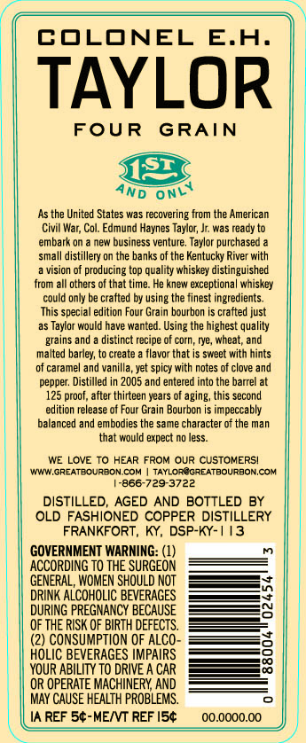
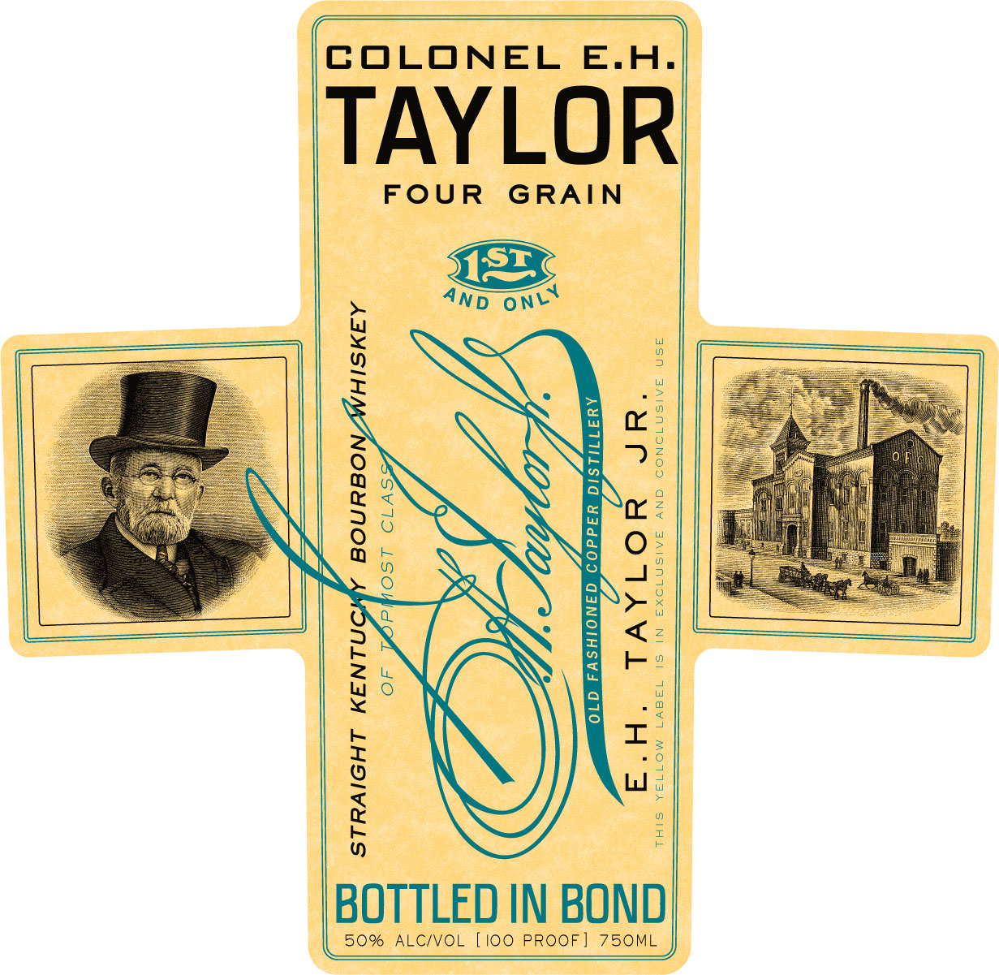
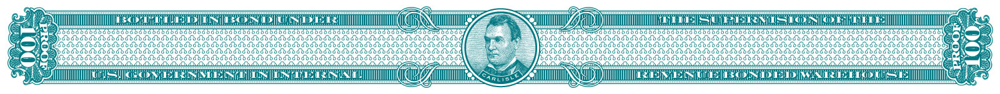

# TTB COLA Label Images - TTBID 17124001000313

**Brand Name:** COLONEL E.H. TAYLOR

**Issue Date:** 05/14/2017

**Origin Code:** 22

**Product Class/Type:** 141

**Source:** [TTB Public COLA Registry](https://ttbonline.gov/colasonline/viewColaDetails.do?action=publicFormDisplay&ttbid=17124001000313)

## Label Images

### Back Label

### Label 1

### Label 2

## Extracted Label Text

*Text extracted via OCR - may contain errors*

### Back Label

COLONEL E.H.

TAYLOR

FOUR GRAIN

AND ON

As the United States was recovering from the American

Civil War, Col. Edmund Haynes Taylor, J. was ready to

‘embark on a new business venture. Taylor purchased a

small distillery on the banks of the Kentucky River with

a vision of producing top quality whiskey distinguished

from all others ofthat time. He knew exceptional whiskey

could only be crafted by using the finest ingredients.

This special edition Four Grain bourbon is crafted just

as Taylor would have wanted. Using the highest quality

grains and a distinct recipe of corn, rye, wheat, and

alted barley, to create a flavor that is sweet with hints

of caramel and vanilla, yet spicy with notes of clove and

pepper: Distilled in 2005 and entered into the barrel at

125 proo, ater thirteen years of aging, this second

edition release of Four Grain Bourbon is impeccably

balanced and embodies the same character of the man

that would expect no less.

WE LOVE TO HEAR FROM OUR CUSTOMERS!

\WWIW.GREATBOURBON COM | TAYLOR@GREATBOURBON.COM

[866-729-3722

DISTILLED, AGED AND BOTTLED BY

OLD FASHIONED COPPER DISTILLERY

FRANKFORT, KY, DSP-KY-

GOVERNMENT WARNING: (1)

ACCORDING TO THE SURGEON

GENERAL, WOMEN SHOULD NOT

—_,

DRINK ALCOHOLIC BEVERAGES.

DURING PREGNANCY BECAUSE

OF THE RISK OF BIRTH DEFECTS.

(2) CONSUMPTION OF ALCO-

HOLIC BEVERAGES IMPAIRS.

YOUR ABILITY TO DRIVE A CAR

——

OR OPERATE MACHINERY, AND.

MAY CAUSE HEALTH PROBLEMS.

IA REF

‘-ME/VT REF |

### Label 1

>)

COLONEL E.H.

TAYLOR

FOUR GRAIN

4ND ONY

iN

(nee

7:

e<

oN

26

ge

NY

O-

N

sat ie

i)

i

7S

N>

oy

Le

Fe

Te)

XY

BOTTLED IN BOND

50% ALC/VOL [100 PROOF] 750ML

### Label 2

e

2)

Lexe

(AAU)

res

iD

Y

it

ft

13

Sie!

E00

SUE MSE NTS OS

com

PASE ES]

7

Le

cg

Bgacadoesdaaae

:

Babes

au

ig

ccatgy

eat

Yow

tat

rags

tpaseaead

gua

54

si

doabanévaradanéndednancsecede.

doevenaeebsnddadéeéraedndeceaeasenasanceacecec,

docecbavdbcbancacececscucechcucucuchchcecucecuchcuceescycncuCDcecncecedsdndnceasseeancnd

)

ZosachcvEysacadversrcrdyersrdcrards sacra dacnerersacdyersadecyersesecrsrsacacrersecnendy

i

Poses yEDTASEYeosacVersnsacrarsyEacrsyersacedyersacecrarsedrersosacred

io)

<3

tated:

dosvcacesud

oo

fiat

z

i

ts

oat

pate

sosesese:

pad

et,

tats

S

Vee

pittstststatetss a sabencncncucn coca vocevececeecececsasases eadvandedy.

Seocb ds

&

eC

teks

E cacuascavacueseevaceseucocneugcaene Shchshe le civtsbelceetsocschchand ebcecus escneae aga

i

ra

iu

ack

q

Te

NL

a

Key

fi

SCLC EL ES

OTT

ra

INS
