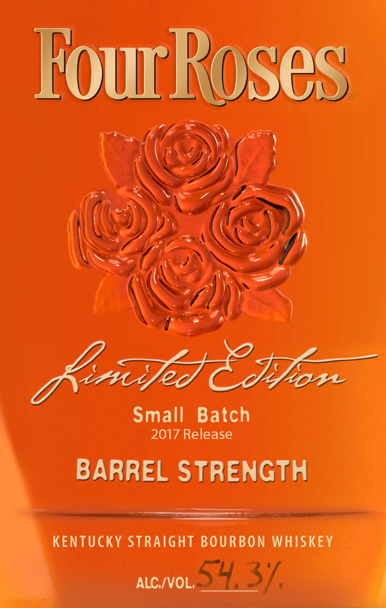
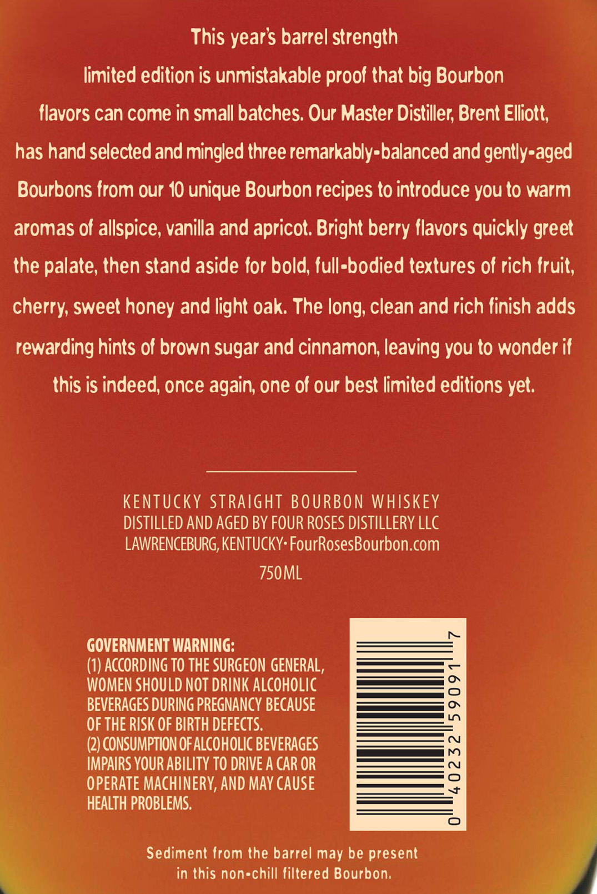
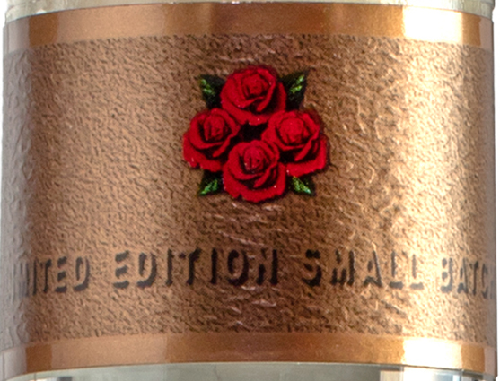

# TTB COLA Label Images - TTBID 17136001000359

**Brand Name:** FOUR ROSES

**Fanciful Name:** LIMITED EDITION SMALL BATCH

**Issue Date:** 05/22/2017

**Origin Code:** 22

**Product Class/Type:** 101

**Source:** [TTB Public COLA Registry](https://ttbonline.gov/colasonline/viewColaDetails.do?action=publicFormDisplay&ttbid=17136001000359)

## Label Images

### Label 1

### Label 2

### Label 3

## Extracted Label Text

*Text extracted via OCR - may contain errors*

### Label 1

tour hoses

O

ee

I

AZ)

Se

es

\

wr

L, syle Ca

Small Batch

e

BARREL STRENGTH

eats

KENTUCKY STRAIGHT BOURBON WHISKEY

ned. 3 vA

/

### Label 2

This year’s barrel strength

limited edition is unmistakable proof that big Bourbon

flavors can come in small batches. Our Master Distiller, Brent Elliott,

has hand selected and mingled three remarkably-balanced and gently-aged

Bourbons from our 10 unique Bourbon recipes to introduce you to warm

aromas of allspice, vanilla and apricot. Bright berry flavors quickly greet

the palate, then stand aside for bold, full-bodied textures of rich fruit,

cherry, sweet honey and light oak. The long, clean and rich finish adds

rewarding hints of brown sugar and cinnamon, leaving you to wonder if

this is indeed, once again, one of our best limited editions yet.

KENTUCKY STRAIGHT BOURBON WHISKEY

DISTILLED AND AGED BY FOUR ROSES DISTILLERY LLC

LAWRENCEBURG, KENTUCKY: FourRosesBourbon.com

750ML

GOVERNMENT WARNING:

(1) ACCORDING TO THE SURGEON GENERAL,

WOMEN SHOULD NOT DRINK ALCOHOLIC

a O

— OY

BEVERAGES DURING PREGNANCY BECAUSE

—— coy

OF THE RISK OF BIRTH DEFECTS.

a |

(2) CONSUMPTION OF ALCOHOLIC BEVERAGES

IMPAIRS YOUR ABILITY TO DRIVE A CAR OR

OPERATE MACHINERY, AND MAY CAUSE

HEALTH PROBLEMS,

Sediment from the barrel may be present

‘

in this non-chill filtered Bourbon.

### Label 3

WS

aS

ae

SAE

a

NA

Ny

&

SAS

-

40

¥y

By:

a

wi

a

tay

v3

)

Sn

eal

ZA

ny

we

a5

Newt

Hy

Sh

ne

st

e

gicy

wh

Baek.

At

Di

*

a =

—_
