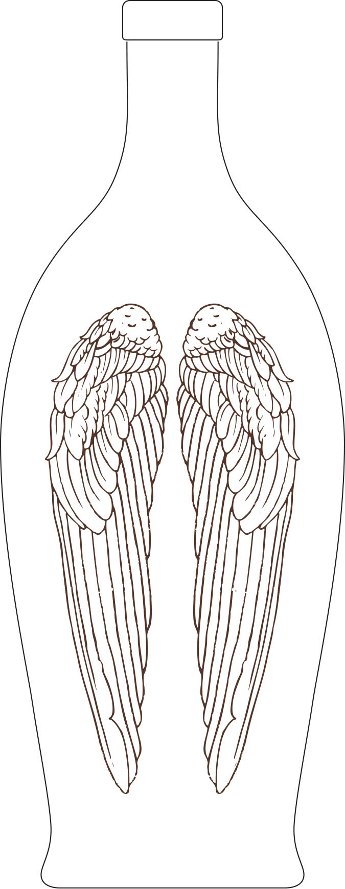
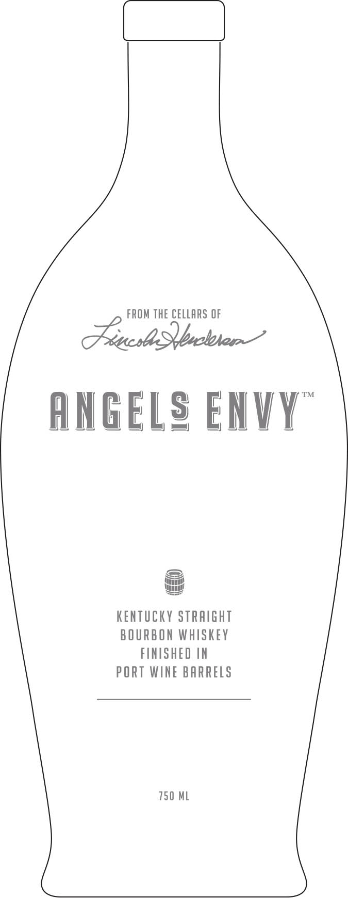
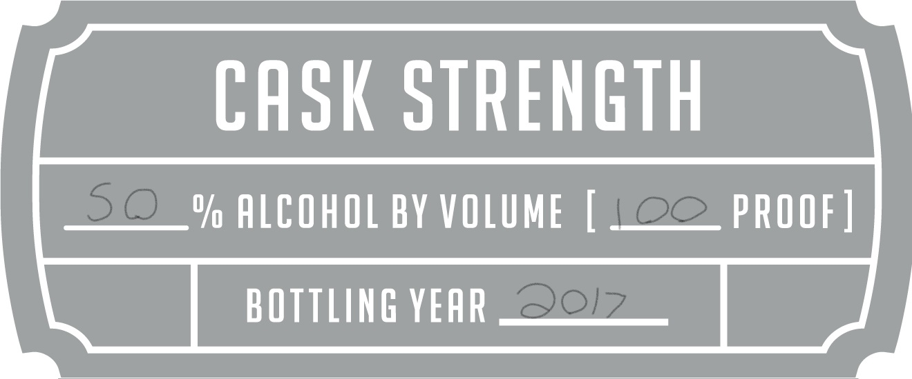
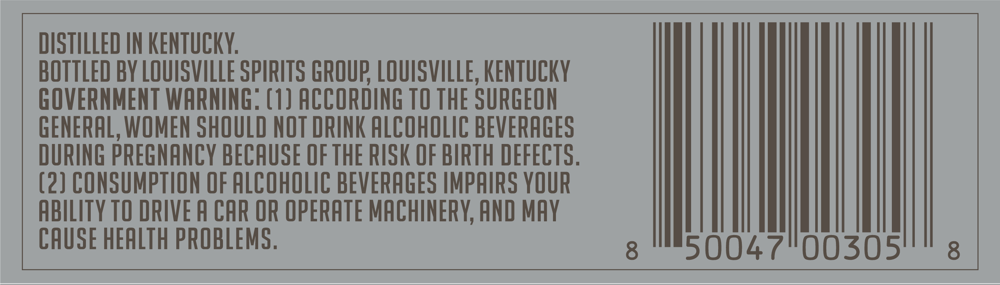
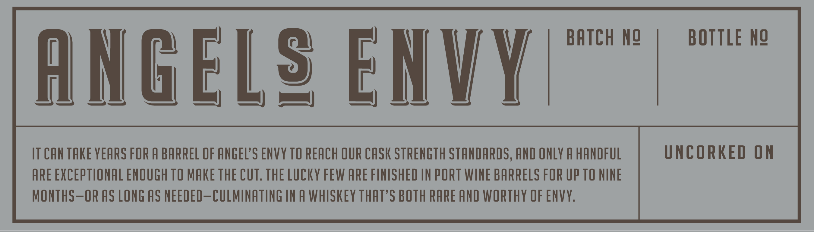

# TTB COLA Label Images - TTBID 17152001000375

**Brand Name:** ANGEL'S ENVY

**Fanciful Name:** CASK STRENGTH

**Issue Date:** 06/07/2017

**Origin Code:** 22

**Product Class/Type:** 641

**Source:** [TTB Public COLA Registry](https://ttbonline.gov/colasonline/viewColaDetails.do?action=publicFormDisplay&ttbid=17152001000375)

## Label Images

### Back Label

### Front Label

### Label 2

### Label 3

### Label 5

### Label 6

## Extracted Label Text

*Text extracted via OCR - may contain errors*

*1 image(s) excluded: text did not meet readability threshold*

### Front Label

FROM ThE CELLARS OF
(usa Sqboben
TM
AnGELg ENVY
KEnTuCKY STRAIGHT
B OURBON WhISKey
FINISHED IN
PORT WINE BARRELS
750 ML

### Label 2

CASK STRENGTH
50_% ALCOHOL BY VOLUME
LOO_PROOF ]
BOTTLING YEAR
9017

### Label 3

DISTILLED IN KENTUCKY:
BOTTLED BY LOUISVILLE SPIRITS GROUF; LOUISVILLE, KENTUCKY
GOVERNMENT WARNING: (1) ACCORDING TO THE SURGEON
GENERAL, WOMEN SHOULD NOT DRINK ALCOHOLIC BEVERAGES
URING PREGNANCY BECAUSE OF THE RISK OF BIRTH DEFECTS .
(2) CONSUMPTION OF ALCOHOLIC BEVERAGES IMPAIRS YOUR
ABILITY TO DRIVE A CAR OR OPERATE MACHINERY, AND MAY
CAUSE HEALTH PROBLEMS .
8
50047"00305
8

### Label 5

FROM THE CELLARS OF LINCOLN HENDERSON
ANGELS ENVY | PORT BARREL FINISH

### Label 6

BATCH n@
BOTTLE Ng
ANGELg ENVY
IT CAN TAKE YEARS FOR A BARREL OF ANGEL'S ENVY TO REACH OUR CASK STRENGTH STANDARDS, AND ONLY A HANDFUL
UNCORKED ON
ARE EXCEPTIONAL ENOUGH TO MAKE ThE CuT.ThE LuCKY FEW ARE FINISHED IN PORT WINE BARRELS FOR UP TO NINE
MONThS-OR AS LONG AS NEEDED-CULMINATING IN A whiSkeY THAT'S BOTH RARE AND WORTHY OF ENVY;
