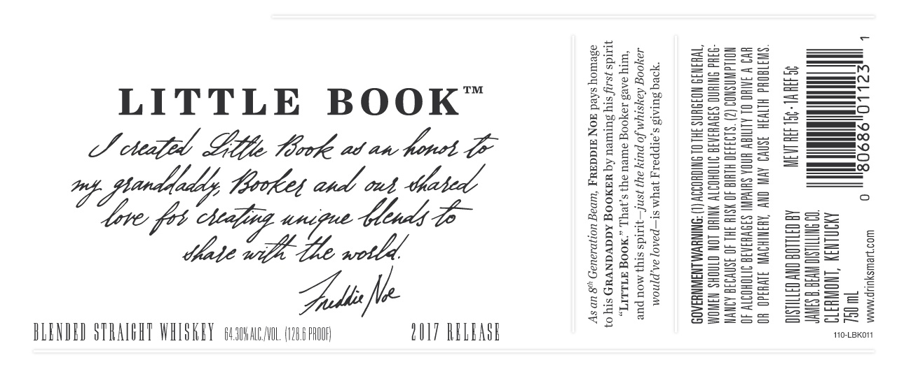

# TTB COLA Label Images - TTBID 17188001000022

**Brand Name:** LITTLE BOOK

**Issue Date:** 07/12/2017

**Origin Code:** 22

**Product Class/Type:** 129

**Source:** [TTB Public COLA Registry](https://ttbonline.gov/colasonline/viewColaDetails.do?action=publicFormDisplay&ttbid=17188001000022)

## Label Images

### Label 1

### Label 2

## Extracted Label Text

*Text extracted via OCR - may contain errors*

*1 image(s) excluded: text did not meet readability threshold*

### Label 1

LITTLE BOOK™
LS cteefd Fie Mook at an hore GE
a Wa
ELD,
Salieft

BLENDED STRAIGHT WHISKEY cans, (1286 poo QOL? RELEASE

drinksmart.com

As an 8" Generation Beam, FREDDIE NOE

to his GRANDADDY BOOKER by
