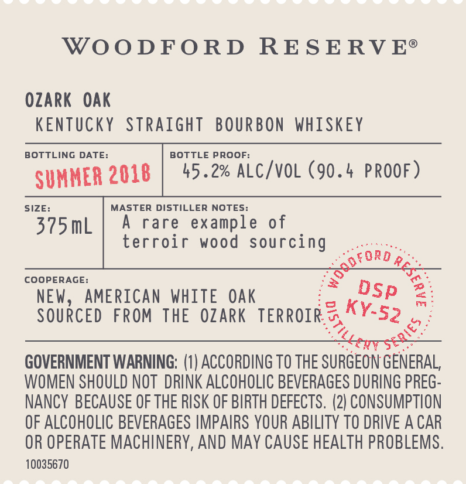

# TTB COLA Label Images - TTBID 17198001000120

**Brand Name:** WOODFORD RESERVE

**Fanciful Name:** DISTILLERY SERIES OZARK OAK

**Issue Date:** 07/19/2017

**Origin Code:** 22

**Product Class/Type:** 101

**Source:** [TTB Public COLA Registry](https://ttbonline.gov/colasonline/viewColaDetails.do?action=publicFormDisplay&ttbid=17198001000120)

## Label Images

### Back Label

### Front Label

### Label 3

### Label 4

