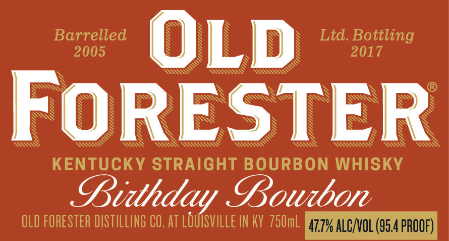
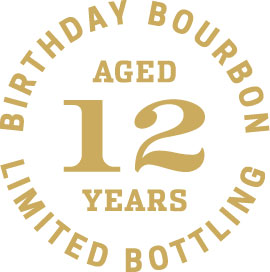
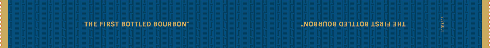
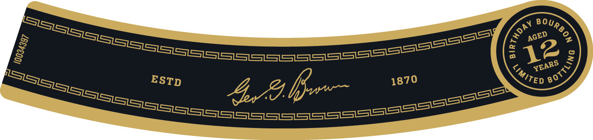

# TTB COLA Label Images - TTBID 17209001000438

**Brand Name:** OLD FORESTER

**Fanciful Name:** BIRTHDAY BOURBON 2017

**Issue Date:** 08/01/2017

**Origin Code:** 22

**Product Class/Type:** 141

**Source:** [TTB Public COLA Registry](https://ttbonline.gov/colasonline/viewColaDetails.do?action=publicFormDisplay&ttbid=17209001000438)

## Label Images

### Back Label

### Front Label

### Label 3

### Label 4

### Label 5

## Extracted Label Text

*Text extracted via OCR - may contain errors*

### Back Label

—2

— 2

— 2

—- oo)

es LO

ES

——_. 6 —__

—— NS =O

——= WH OE

=——O

### Front Label

N

SS

ISS

N

S

Barrelled

rR

N

N

Ltd. Bottling

200

i)

'S

\

2017

S

S

SO

SSN

SI

DIM

N

NS

N

TS

SSS

SS

S

SS

SS

WY

ISS

SS

SSS

SS

N

N

N

S

N

N

N

MSS

S

S

N

S

RSs

SS

SS

S

N

WN

S

S

V

S

S

VN

S

S

$

N

ES

<<<

WV

NG

Ww

I

SK

SSNS

SV

S\N

KENTUCKY STRAIGHT BOURBON WHISKY

ZB, 2

BPBoulbon

OLD FORESTER DISTILLING CO. AT LOUISVILLE IN KY 750ml

### Label 3

ohY Boy

=

<" AGED

oe

12:

cS

% YEARS

>

Ven B ow”

### Label 4

THE FIRST BOTTLED BOURBON”

~NO#UNOF GAILLOG LSald AHL

### Label 5

——
