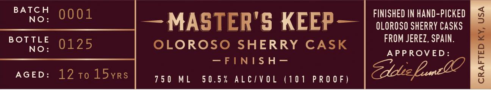
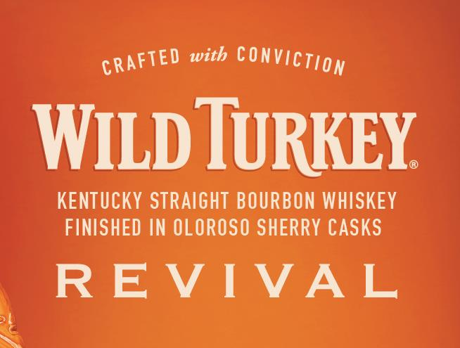
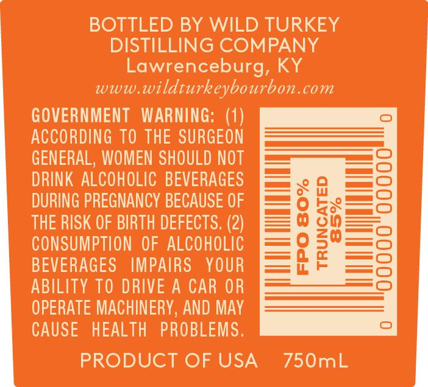
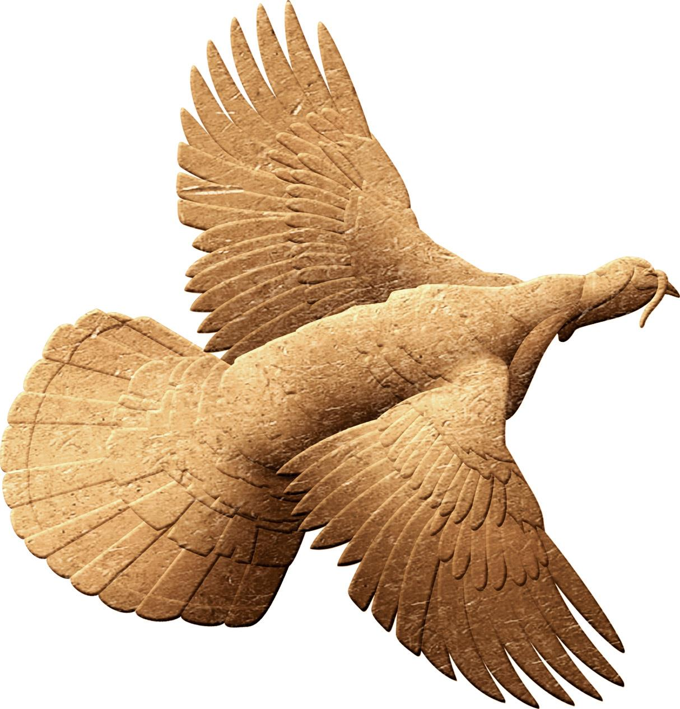
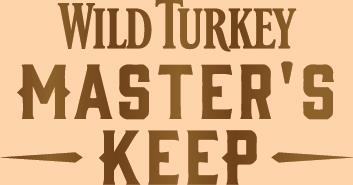

# TTB COLA Label Images - TTBID 17215001000904

**Brand Name:** WILD TURKEY

**Fanciful Name:** REVIVAL

**Issue Date:** 08/28/2017

**Origin Code:** 22

**Product Class/Type:** 641

**Source:** [TTB Public COLA Registry](https://ttbonline.gov/colasonline/viewColaDetails.do?action=publicFormDisplay&ttbid=17215001000904)

## Label Images

### Label 1

### Label 2

### Label 3

### Label 4

### Label 5

## Extracted Label Text

*Text extracted via OCR - may contain errors*

### Label 1

FINISHED IN HAND-PICKED

eae Do0!

— MASTER'S KEEP—

OLOROSO SHERRY CASKS

Bouse

0125

OLOROSO SHERRY CASK

FROM JEREZ, SPAIN.

No:

= INDY [ah

BEER OVED:

AGED: 1210 15yrs

750 ML

50.5% ALC/VOL (101 PROOF)

### Label 2

CRAFTED with CONVICT gy

WILD TURKEY.

KENTUCKY STRAIGHT BOURBON WHISKEY

FINISHED IN OLOROSO SHERRY CASKS

REVIVAL

### Label 3

Boy ee WILD TURKEY

1G COMPANY

pia

200 U

rg, KY

www.w

lturke

bon.com

GOVERNMENT WARNING: (i) )

at RDING TO TE

SURG

yOM

{OULD

—_—

D

HOLIC BEVE

mn 0 0

i]

1G PREGNANCY BECAUSE

OF

=

Tal ee

ur

—T

mee O GS es O

ohb==

SK OF BIRTH DEFECTS. (2 (2)

=0 50

—Tas)

eu ION OI

Ee

COHOLIC

=—=fAc

EVERAGE

ES

Yo

R

p

Le

i)

iB

LITY TO DR

AC

oP

MACHINERY, AN

CA

HEALTH PROBLEMS.

PRODUCT OF USA

750mL

### Label 4

wv

» F

Se

ee

eee:

we.

SS

a

i

a

xm

—

aad

me

a

as

e

“g

Fete

254

oF

ars

a

A

ae

SF

<

=.

££

NS

ASE:

~

### Label 5

WILD TURKEY

MASTER'S
