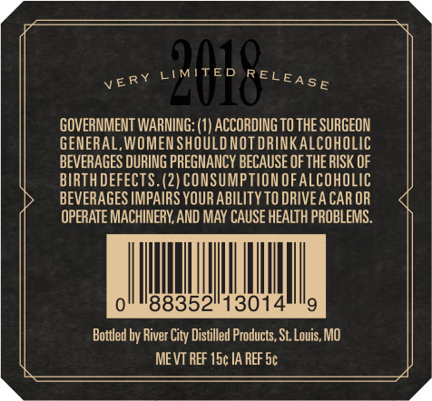
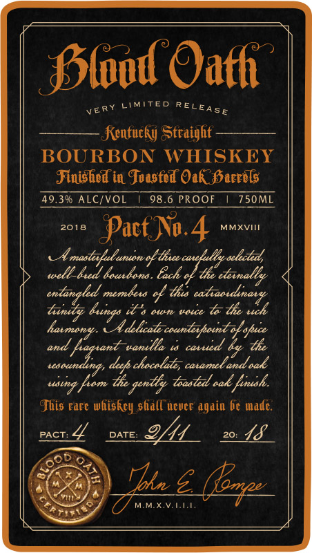
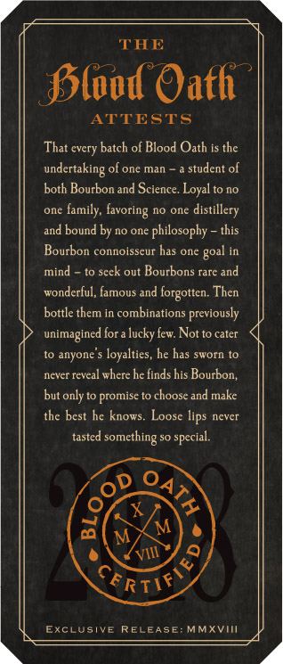

# TTB COLA Label Images - TTBID 17251001000254

**Brand Name:** BLOOD OATH

**Fanciful Name:** PACT NO. 4

**Issue Date:** 09/13/2017

**Origin Code:** 29

**Product Class/Type:** 641

**Source:** [TTB Public COLA Registry](https://ttbonline.gov/colasonline/viewColaDetails.do?action=publicFormDisplay&ttbid=17251001000254)

## Label Images

### Back Label

### Front Label

### Label 3

### Label 4

### Label 5

## Extracted Label Text

*Text extracted via OCR - may contain errors*

### Back Label

very UIMITED)REL EA. |

GOVERNMENT WARNING: (1) ACCORDING TO THE SURGEON

GENERAL, WOMEN SHOULD NOTDRINKALCOHOLIC

BEVERAGES DURING PREGNANCY BECAUSE OF THE RISK OF

BIRTH DEFECTS. (2) CONSUMPTION OF ALCOHOLIC

BEVERAGES IMPAIRS YOUR ABILITY TO DRIVEA CAR OR

OPERATE MACHINERY, AND MAY CAUSE HEALTH PROBLEMS.

Ih

Mh

0

88352

13014

9

Bottled by River City Distilled Products, St.Louis, MO

MEVT REF 15¢ IA REF 5¢

### Front Label

Plood Oath

very LIMITED RELegg,

flentucky Straight

BOURBON WHISKEY

Finished in Toasted Ook Hervels

49.3% ALC/VOL | 98.6 PROOF | 750ML

2018 Pact No.4 Mmxvitt

A masliyfed anionef thee

well baed bausbans. bach

J iily

sntingled membus of th atiaodivary

tantly bangs its osm voice te lhe uch

and,

‘wanelle ta coved by The

es

ng fam the gnitly tani oak fiaihe

This rare whiskey shallnever again be made.

pact: L

fs QE

20: ff.

6c

ty.

### Label 3

6

MMX VET

### Label 4

A EEE ETS

THE

Bil

of Oath

That every batch of Blood Oath is the

undertaking of one man ~ a student of

both Bourbon and Science. Loyal to no

one family, favoring no one distillery

and bound by no one philosophy ~ this

Bourbon connoisscur has one goal in

mind - to seek out Bourbons rare and

wonderful, famous and forgotten. Then

bottle them in combinations previously

unimagined fora lucky few. Not to cater

to anyone's loyalties, he has sworn to

never reveal where he finds his Bourbon,

but only to promise to choose and make

the best he knows. Loose lips never

tasted something so special.

oP 4,

Se

RTM

EXCLUSIVE RELEASE: MMXVIII

NY

y
