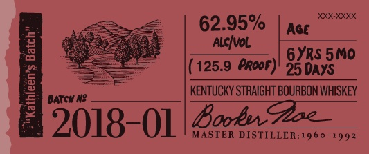
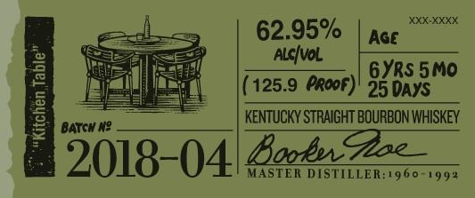

# TTB COLA Label Images - TTBID 17276001000565

**Brand Name:** BOOKER'S

**Issue Date:** 10/05/2017

**Origin Code:** 22

**Product Class/Type:** 101

**Source:** [TTB Public COLA Registry](https://ttbonline.gov/colasonline/viewColaDetails.do?action=publicFormDisplay&ttbid=17276001000565)

## Label Images

### Label 1

### Label 2

### Label 3

### Label 4

### Label 5

## Extracted Label Text

*Text extracted via OCR - may contain errors*

### Label 1

booker

Bho Wibuy tm shea frchege Ae

(es

mila

Satta sper tds ur fll

Wy rm o lin Loan bh his

eee, || == |

PEN LES epens

s<¢e

barrel tured.

cened jlo .

### Label 2

62.95%

(125.9 PRooF)

25 DAYS

Boobs STRAIGHT BOURBON WHISKEY

5018- Ol food Ha 1960-1992

### Label 3

62.95%

(125.9 Proof)

E

25 DAYS

BATCH N2

KENTUCKY STRAIGHT BOURBON WHISKEY

2018-04. MASTER DISTILLER:1960-1993

### Label 4

l

80686'01140'

### Label 5

»—~
