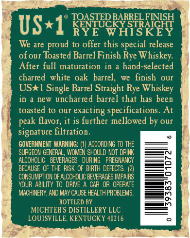
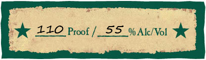
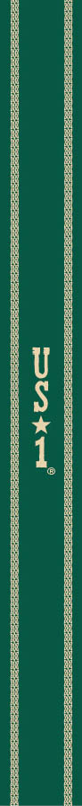
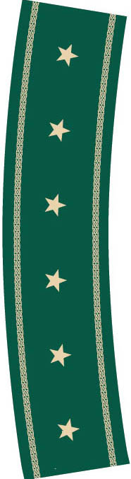
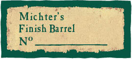

# TTB COLA Label Images - TTBID 17291001000533

**Brand Name:** MICHTER'S

**Fanciful Name:** TOASTED BARREL FINISH

**Issue Date:** 10/23/2017

**Origin Code:** 22

**Product Class/Type:** 102

**Source:** [TTB Public COLA Registry](https://ttbonline.gov/colasonline/viewColaDetails.do?action=publicFormDisplay&ttbid=17291001000533)

## Label Images

### Back Label

### Front Label

### Label 4

### Label 5

### Label 6

## Extracted Label Text

*Text extracted via OCR - may contain errors*

*4 image(s) excluded: text did not meet readability threshold*

### Back Label

US*1" [8pee8pI83REY
W
We are proud to offer this special release
ofour Toasted Barrel Finish Rye Whiskey:
After full maturation in a hand-selected
charred white oak barrel,
we   finish
OUI
USX1 Single Barrel Straight Rye Whiskey
in & Dew uncharred barrel that has been
toasted to OUT
exacting specifications
At
flavor; it is further mellowed by our
signature filtration.
GOVERNHENT  WARNING: (1) ACCORDING TO THE
SURGEON GENERAL , WOMEN SHOULD NOT DRINK
ALCOHOLIC
BEVERAGES   DURING   PREGNANCY
BECAUSE OF THE RISK OF BIRTH DEFECTS
CONSUMPTION OF ALCOHOLIC BEVERAGES IMPAIRS
YOUR ABILITY to DRIVE A CAR OR OPERATE
MACHINERY, AND MaY CAUSE HEALTH PROBLEMS.
BOTTLED BY
MICHTERS DISTILLERY LLC
LOUISVILLE KENTUCKY 40216
peak
