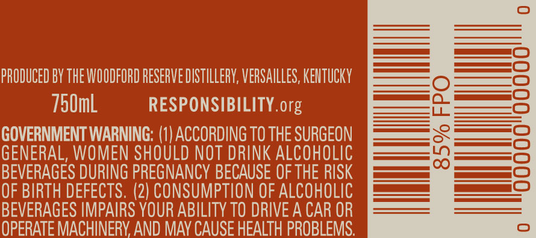
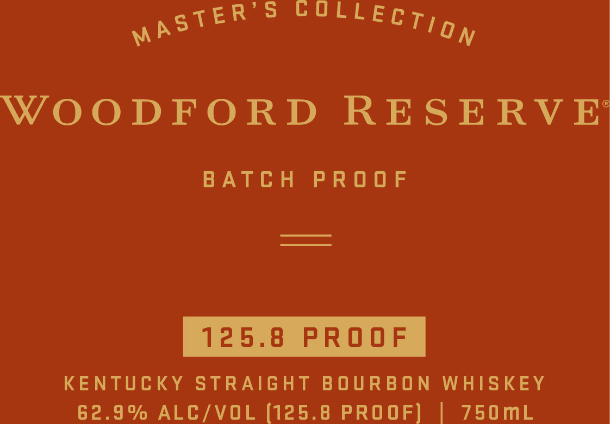
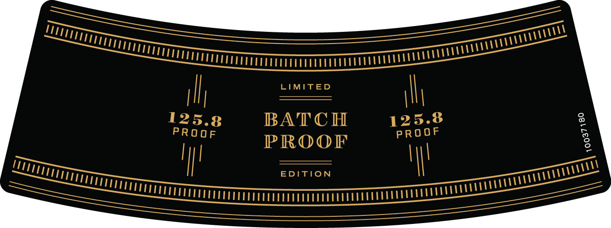

# TTB COLA Label Images - TTBID 17311001000633

**Brand Name:** WOODFORD RESERVE

**Fanciful Name:** MASTER'S COLLECTION BATCH PROOF

**Issue Date:** 11/18/2017

**Origin Code:** 22

**Product Class/Type:** 101

**Source:** [TTB Public COLA Registry](https://ttbonline.gov/colasonline/viewColaDetails.do?action=publicFormDisplay&ttbid=17311001000633)

## Label Images

### Back Label

### Front Label

### Label 3

### Label 4

## Extracted Label Text

*Text extracted via OCR - may contain errors*

### Back Label

PRODUCED BY THE WOODFORD RESERVE DISTILLERY, VERSAILLES, KENTUCKY

750mL

RESPONSIBILITY. org

GOVERNMENT WARNING: (1) ACCORDING TO THE SURGEON

GENERAL, WOMEN SHOULD NOT DRINK ALCOHOLIC

BEVERAGES DURING PREGNANCY BECAUSE OF THE RISK

OF BIRTH DEFECTS. (2) CONSUMPTION OF ALCOHOLIC

BEVERAGES IMPAIRS YOUR ABILITY TO DRIVE A CAR OR

OPERATE MACHINERY AND MAY CAUSE HEALTH PROBLEMS.

### Front Label

psTER Ss OOTLECT ag

WOODFORD RESERVE

BATCH PROOF

————

———

KENTUCKY STRAIGHT BOURBON WHISKEY

62.9% ALC/VOL (125.8 PROOF] | 750mL

### Label 3

=

—=

mn

uu

2

) L

fal

) (

7

S

==

=

———

### Label 4

u

lay

Sv

HAND-SE

D BY

10037181

Ad a

2 aTAS auvar

MAS1

ER DIST

R

Unio M

nt)
