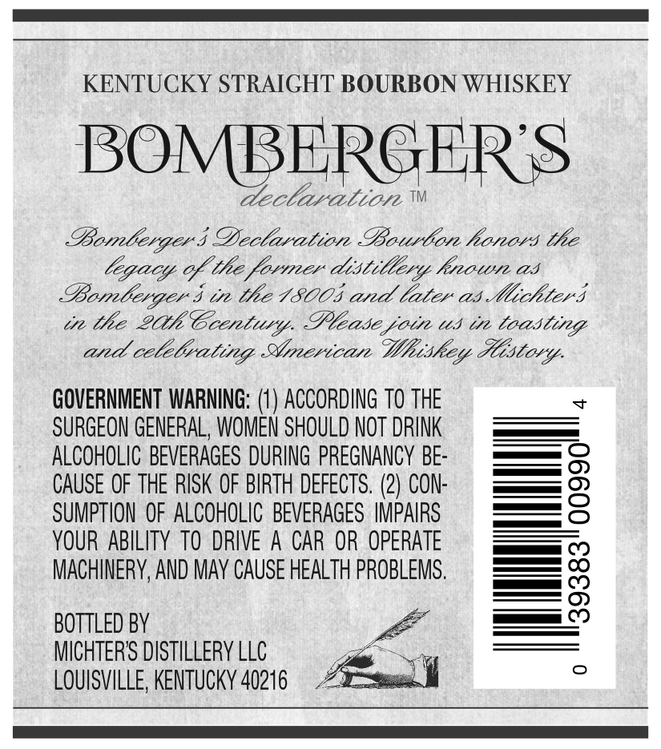
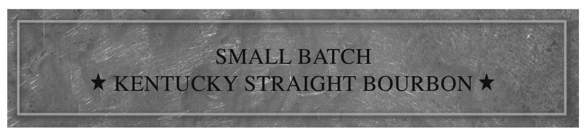
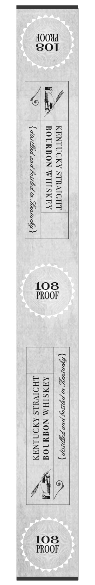

# TTB COLA Label Images - TTBID 17347001000282

**Brand Name:** BOMBERGER'S

**Fanciful Name:** DECLARATION

**Issue Date:** 12/18/2017

**Origin Code:** 22

**Product Class/Type:** 101

**Source:** [TTB Public COLA Registry](https://ttbonline.gov/colasonline/viewColaDetails.do?action=publicFormDisplay&ttbid=17347001000282)

## Label Images

### Back Label

### Front Label

### Label 4

## Extracted Label Text

*Text extracted via OCR - may contain errors*

### Back Label

KENTUCKY STRAIGHT BOURBON WHISKEY

BOMBEI

ER'S

cela caliote

Bomle LAGE I DYeclwation Bourlor honors the

COM. oY the forties aistitlery, hrvowte as

OL GEL Str he 15005 and later at Micliler$s

te the Lhe Coentiy, Vlease pote us te loasliteg.

and cole Crating Girertccare

Litho. Mistory

GOVERNMENT WARNING: (1) ACCORDING TO THE

SURGEON GENERAL, WOMEN SHOULD NOT DRINK

ALCOHOLIC BEVERAGES DURING PREGNANCY BE

er

— OQ

CAUSE OF THE RISK OF BIRTH DEFECTS. (2) CON

SUMPTION OF ALCOHOLIC BEVERAGES IMPAIRS

—O

YOUR ABILITY TO DRIVE A CAR OR OPERATE

= 00

ee CD

ACHINERY, AND MAY CAUSE HEALTH PROBLEMS

oe CD

ASP)

BOTTLED BY

ICHTERS DISTILLERY LLC

LOUISVILLE, KENTUCKY 40216

a

### Front Label

iN

### Label 4

A00Ud

SOL

cl

BA

om

aZz

we

Zr

Sa

= 4

iz

ae

ane)

“4

108

PROOF

sai!

ON

a=

ase

34

ne)

aie

5 4

ae)

Ze

Mee

/\p

108

PROOF
