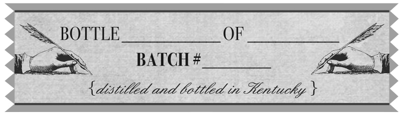
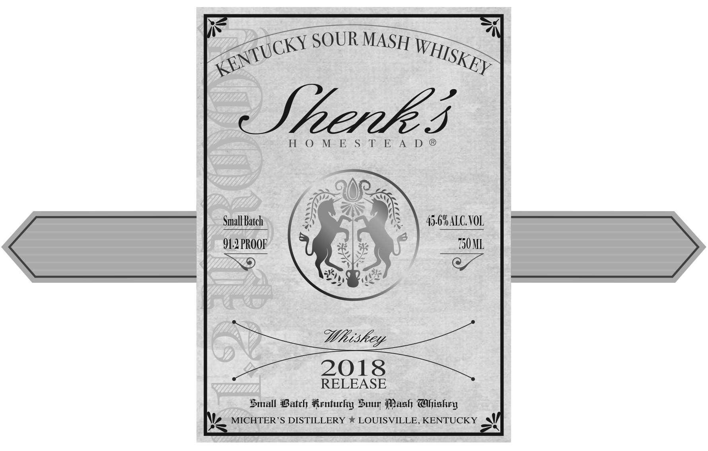

# TTB COLA Label Images - TTBID 17347001000293

**Brand Name:** SHENK'S

**Fanciful Name:** HOMESTEAD

**Issue Date:** 12/21/2017

**Origin Code:** 22

**Product Class/Type:** 140

**Source:** [TTB Public COLA Registry](https://ttbonline.gov/colasonline/viewColaDetails.do?action=publicFormDisplay&ttbid=17347001000293)

## Label Images

### Back Label

### Front Label

### Label 2

### Label 4

## Extracted Label Text

*Text extracted via OCR - may contain errors*

*1 image(s) excluded: text did not meet readability threshold*

### Back Label

<a cK § ‘SOUR MASH y Weis,

Skpp

eee

HOME

SoBe A- D-™

Shenk’s Homestead Sour Mash Whiskey

honors the legacy of American whiskey figure

John Shenk, who in 1753 founded a distillery

that was to become known as Michter’s in

the 20th Century. Please join us in toasting and

celebrating American Whiskey History

GOVERNMENT WARNING:

1) ACCORDING

0 THE SURGEON GE

RAL, WOMEN

SHOULD NO

DRINK ALCOHOLIC

——_4e2)

= N

BEVERAGES DURING PREGNANCY BE

—

CAUSE OF THE RISK OF BIRTH DEFECTS.

— ©

2) CONSUMPTION OF ALCOHOLIC

— O

BEVERAGES IMPAIRS YOUR ABILITY TO

-———fee)

ee CD

DRIVE A CAR OR OPERATE MACHINERY,

ise)

AND MAY CAUSE HEALTH PROBLEMS

= oOo

BOTTLED BY

TA)

ICHTERS DISTILLERY LLC

QUISVILLE, KENTUCKY 40216

### Front Label

=~

OTTLE

~

OF

LAs

Me

Bet

BATCH #

4 dstilled and bottled in Kentucky ,

### Label 2

Pac UR MASH me
cKY SO W,
ex USK py:
Spek. j
H-O- MeE Se TE AyD ®
ey ns
Kas es
Small |S) vs 4.6A10.V01
O12 PROOF € Ce) so
c 2) py is ©
Sse
Whiskey
2018
RELEASE
Small Batch Kentucky Suny Pash Ghiskey
Me MICHTER’S DISTILLERY * LOUISVILLE, KENTUCKY a
