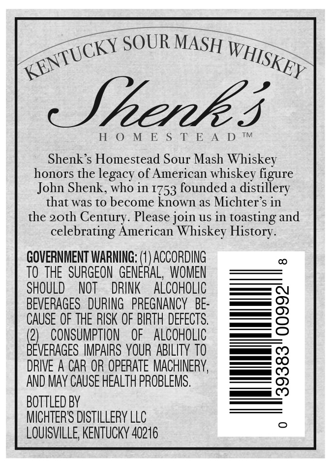
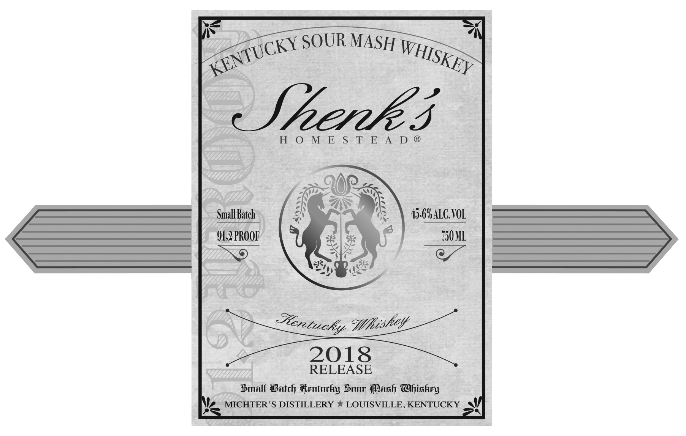

# TTB COLA Label Images - TTBID 17354001000797

**Brand Name:** SHENK'S

**Fanciful Name:** HOMESTEAD

**Issue Date:** 01/04/2018

**Origin Code:** 22

**Product Class/Type:** 140

**Source:** [TTB Public COLA Registry](https://ttbonline.gov/colasonline/viewColaDetails.do?action=publicFormDisplay&ttbid=17354001000797)

## Label Images

### Back Label

### Front Label

### Label 1

### Label 4

## Extracted Label Text

*Text extracted via OCR - may contain errors*

*1 image(s) excluded: text did not meet readability threshold*

**Detected Proof:** 91.2

### Back Label

SOUR MASH
Jnenk 3
H
0
M
E
S
T E A
D
TM
Shenk 's Homestead Sour Mash Whiskey
honors the legacy of American whiskey figure
John Shenk, who in 1753 founded a distillery
that was to become known as Michter s in
the 2oth Century. Please join US in toasting and
celebrating American Whiskey History.
GOVERNMENT WARNING: (1 ) ACCORDING
TO THE   SURGEON   GENERAL,  WOMEN
SHOULD
NOT
DRINK
ALCOHOLIC
BEVERAGES   DURING   PREGNANCY  BE:
g
CAUSE OF THE RISK OF BIRTH DEFECTS.
(21
CONSUMPTHON
OF
ALCOHOLIC
BEVERAGES IMPAIRS YOUR ABILITY TO
DRIVE A CAR OR OPERATE MACHINERY,
8
AND MAY CAUSE HEALTH PROBLEMS ,
BottLed BY
MICHTERS DISTILLERY LLC
LOUISVILLE; KENTUCKY 40216
KENTUCKY
WHISKEY

### Front Label

=~

OTTLE

~

OF

LAs

Me

Bet

BATCH #

4 dstilled and bottled in Kentucky ,

### Label 1

Small Batch
91.2 PROOF

ereticehy Bhi?

RELEASE

Small Bateh Kentucky Suuy Mash Ghiskry
Nz MICHTER’S DISTILLERY * LOUISVILLE, KENTUCKY ol
