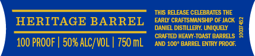
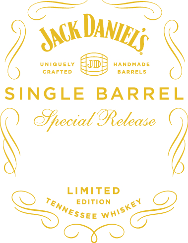
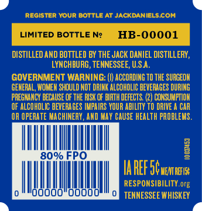

# TTB COLA Label Images - TTBID 18017001000600

**Brand Name:** JACK DANIEL'S

**Fanciful Name:** SINGLE BARREL SPECIAL RELEASE

**Issue Date:** 01/18/2018

**Origin Code:** 43

**Product Class/Type:** 140

**Source:** [TTB Public COLA Registry](https://ttbonline.gov/colasonline/viewColaDetails.do?action=publicFormDisplay&ttbid=18017001000600)

## Label Images

### Front Label

### Label 2

### Label 3

### Label 4

## Extracted Label Text

*Text extracted via OCR - may contain errors*

### Front Label

IS RELEASE CELEBRATES THE

HERITAGE BARREL

DDANIEL DISTILLERY, UNIQUELY

EARLY CRAFTSMANSHIP OF JACK.

‘CRAFTED HEAWY-TOAST BARRELS

100 PROOF | 50% ALC/VOL | 750 mL

{AND 100" BARREL ENTRY PROOF.

### Label 2

enevecr ODE wronsoe

i Barrets

\

SINGLE BARREL

4

LIMITED

EDITION

Qn

ee

### Label 3

Ss 22Q GS882Q (ESD) GSS ISSN

12-0560

02.31.18

SPECIAL

R18

oa

%

BARREL We

oTTuNe DATE

RELEASE

cK te

ASTER DISTILLER

%

=

¢

Le SS eS Se De

### Label 4

REGISTER YOUR BOTTLE AT JACKDANIELS.COM

| unre some | H-00001 |

DISTILLED AND BOTTLED BY THE JACK DANIEL DISTILLERY,

LYNCHBURG, TENNESSEE, U.S.A.

GOVERNMENT WARNING: (|) ACCORDING T0 THE SURGEON

GENERAL, WOMEN SHOULD NOT DRINK ALCOHOLIC BEVERAGES DURING

PREGNANCY BECAUSE OF THE RISK OF BIRTH DEFECTS. (2) CONSUMPTION

OF ALCOHOLIC BEVERAGES IMPAIRS YOUR ABILITY TO DRIVE A CAR

OA OPERATE MACHINERY, AND MAY CAUSE HEALTH PROBLEMS.

5

a

S

a

AREF Sonus

RESPONSIBILITY. org

TENNESSEE WHISKEY
