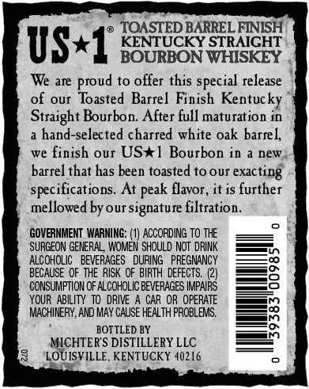
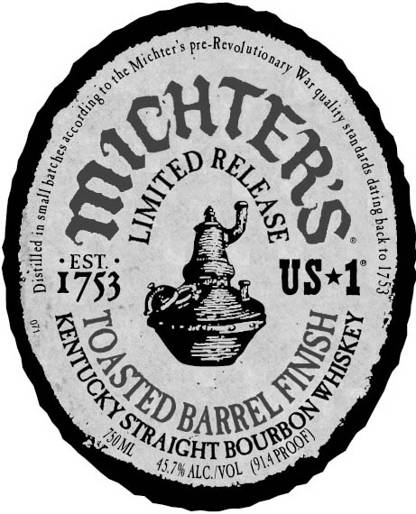
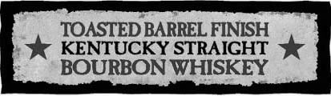
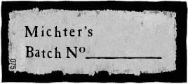
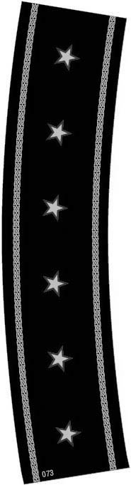
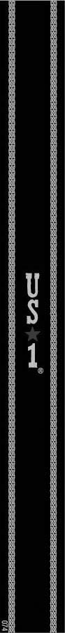

# TTB COLA Label Images - TTBID 18040001000625

**Brand Name:** MICHTER'S

**Fanciful Name:** TOASTED BARREL FINISH

**Issue Date:** 02/26/2018

**Origin Code:** 22

**Product Class/Type:** 101

**Source:** [TTB Public COLA Registry](https://ttbonline.gov/colasonline/viewColaDetails.do?action=publicFormDisplay&ttbid=18040001000625)

## Label Images

### Back Label

### Front Label

### Label 1

### Label 3

### Label 5

### Label 6

## Extracted Label Text

*Text extracted via OCR - may contain errors*

### Back Label

@ TOASTED BARREL FINISH,

KENTUCKY STRAIGHT

US*

BOURBON WHISKEY

We are proud to offer this special release

of our Toasted Barrel Finish Kentucky

Straight Bourbon. After full maturation in

a hand-selected charred white oak barrel,

we finish our US*1 Bourbon in a new,

barrel that has been toasted to our exacting

specifications. At peak flavor, it is further

mellowed by our signature filtration.

GOVERNMENT WARNING: (1) ACCORDING TO THE

‘SURGEON GENERAL, WOMEN SHOULD NOT DRINK

ALCOHOLIC BEVERAGES DURING PREGNANCY

BECAUSE OF THE RISK OF BIRTH DEFECTS. (2)

GONSUMPTION OF ALCOHOLIC BEVERAGES IMPAIRS

YOUR ABILITY TO DRIVE A CAR OR OPERATE

=

-—

MACHINERY, AND MAY CAUSE HEALTH PROBLEMS.

BOTTLED BY

ICHTER'S DISTILLERY LLC

JISVILLE, KENTUCKY 40216

### Front Label

oS

4) OS

ee

*

so

er

aul

EST.

E2

ge

1753

et, US*1

at ong

tp:

o

A,

“My

IGHT B

“ey

Sy

S7harc vor. ©

### Label 1

TOASTED BARREL FINISH

KENTUCKY STRAIGHT

BOURBON WHISKEY

### Label 3

Michter’s

é Batch N®.
