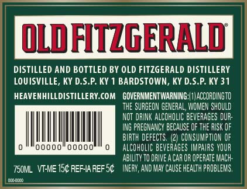
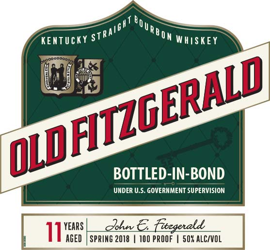
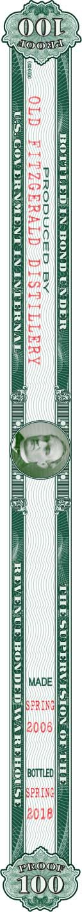

# TTB COLA Label Images - TTBID 18043001000060

**Brand Name:** OLD FITZGERALD

**Issue Date:** 02/15/2018

**Origin Code:** 22

**Product Class/Type:** 101

**Source:** [TTB Public COLA Registry](https://ttbonline.gov/colasonline/viewColaDetails.do?action=publicFormDisplay&ttbid=18043001000060)

## Label Images

### Back Label

### Label 1

### Label 3

### Label 4

## Extracted Label Text

*Text extracted via OCR - may contain errors*

### Back Label

OLD FITZGERALD

DISTILLED AND BOTTLED BY OLD FITZGERALD DISTILLERY

LOUISVILLE, KY D.S.P. KY 1 BARDSTOWN, KY D.S.P. KY 31

HEAVENHILLDISTILLERY.COM  GOVERNMENTWARNING:|) ACCORDINGTO

THE SURGEON GENERAL, WOMEN SHOULD

NOT DRINK ALCOHOLIC BEVERAGES DUR-

ING PREGNANCY BECAUSE OF TH

|

|

|

|

|

|

BIRTH DEFECTS. (2) CONSUMPTION OF

00000)

ocd!

|

ALCOHOLIC BEVERAGES IMPAIRS YOUR

ABILITY TO DRIVE A CAR OR OPERATE MACH-

TS0ML VI-ME15¢ REFIAREFS¢  INERY, AND MAY CAUSE HEALTH PROBLEMS,

zat

### Label 1

KENTUCKY §

real

MON wajsKEY

iri

‘O

i

a

grat

pre

BOTTLED-IN-BOND

=

UNDER U.S. GOVERNMENT SUPERVISION.

=

r

YEARS

iE AGED

### Label 4

G

ee

MADE

BOTTLED) fox
