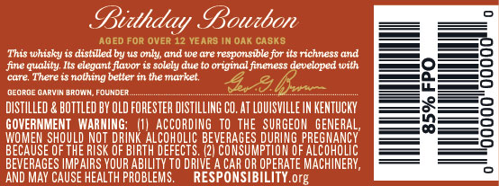
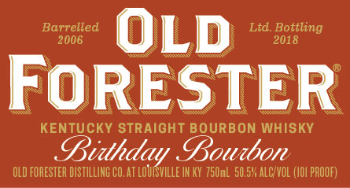
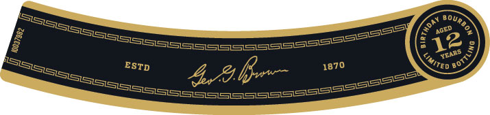
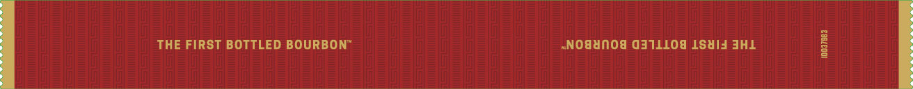

# TTB COLA Label Images - TTBID 18057001000228

**Brand Name:** OLD FORESTER

**Fanciful Name:** BIRTHDAY BOURBON 2018

**Issue Date:** 02/28/2018

**Origin Code:** 22

**Product Class/Type:** 101

**Source:** [TTB Public COLA Registry](https://ttbonline.gov/colasonline/viewColaDetails.do?action=publicFormDisplay&ttbid=18057001000228)

## Label Images

### Back Label

### Front Label

### Label 2

### Label 3

## Extracted Label Text

*Text extracted via OCR - may contain errors*

*1 image(s) excluded: text did not meet readability threshold*

**Detected Age:** 12 Years

### Back Label

Bidthday Goutbon
AOED FoR OVER 12 YEARS IN OaK casks
This whisky
distalled by uS only; and we are responsible for its richness and
fine quality Ils elegant flavor i$ solely due
original fineness developed with
Cute
There $
nolhing better in the market;
deoademapyinaadyCM
FOUNdea
4 &R
DISTILLED & BOTTLed BY OLD FORESTER DISTILLING CO. AT LOUISVILLE IN KENTUCKY
GOVERNMENT   WARNING:
AccordING   TO  THE SURGEON
BEHESE HoULp
NBT
BeBUaIA GEEEUS GeveoAsEspua
Puogf
53
BEVERAGES IMPAIRS YOUR ABILITY TO DRIVE
CAR OR OPERATE MACHINERY ,
AND May CAUSE HEALTH PROBLEMS.
RESPONSIBILITY
org

### Front Label

Barrelled
OLD
Ltd Bottling
2006
2018
FORESTER
KENTUCKY STRAIGHT BOURBON WHISKY
Bidthday Gouibon
OLD FORESTER DSTILLING CO.AT LoursVIlLe IN KY 75OmL  50,.5* alcVOL (L0| proof)

### Label 2

ESTD
496
1870
Gourboa
ACED
I
12
)
caRS
Limited
