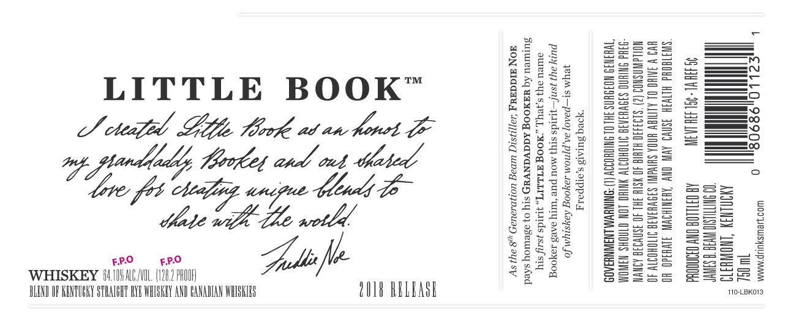
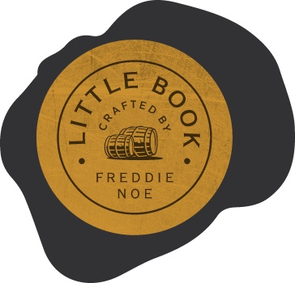

# TTB COLA Label Images - TTBID 18072001000320

**Brand Name:** LITTLE BOOK

**Issue Date:** 04/04/2018

**Origin Code:** 22

**Product Class/Type:** 140

**Source:** [TTB Public COLA Registry](https://ttbonline.gov/colasonline/viewColaDetails.do?action=publicFormDisplay&ttbid=18072001000320)

## Label Images

### Label 1

### Label 2

## Extracted Label Text

*Text extracted via OCR - may contain errors*

### Label 1

as

25

gE

as

LITTLE BOOK™

zx

Eas

Be

o cele Gop Mook at an foret GE

Ega

2°

Ve

i flendadty

£

:

SQsee5

Sza8

TREUS

love: feb

and,

teadh do

===

ee

tate with ihe wotld.

WHISKEY 6 il. /W0L (128.2 PROD

FPO

FPO

=e

ees

=s

SS

Ss

—

me

=

LIND OF RENTUGKY STRALGHT RYE WHISKEY AND EANADIAN WHISK

Sole .

2018 RELEASE

M0-LBKOIS

### Label 2

yy”
