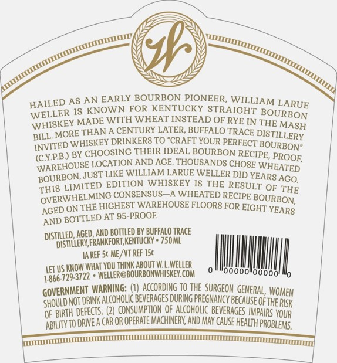
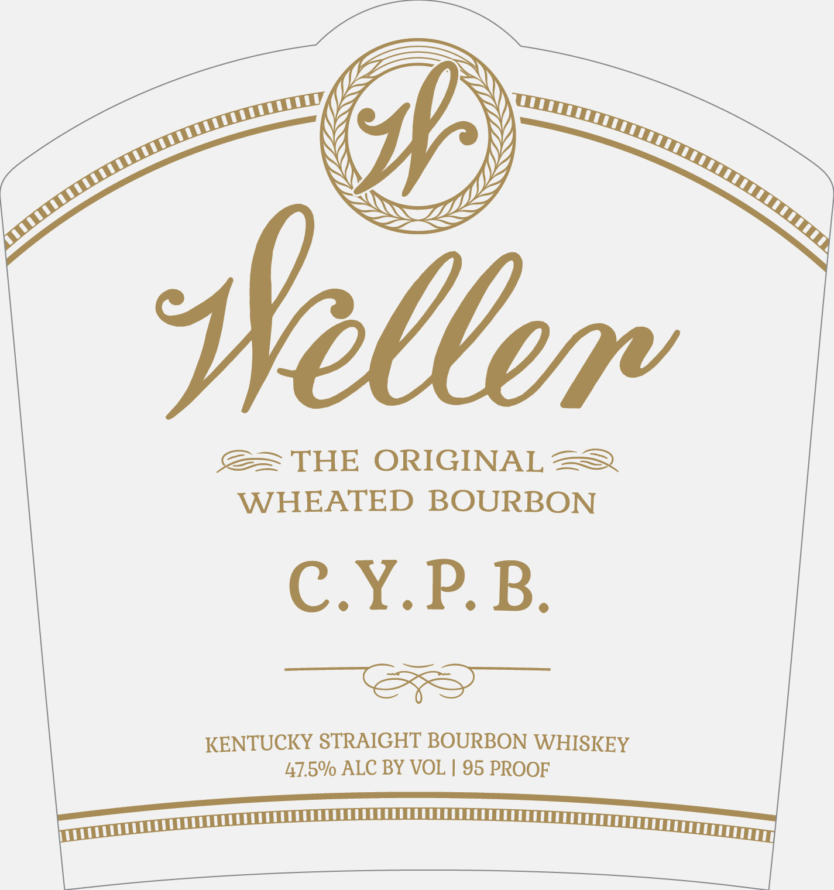

# TTB COLA Label Images - TTBID 18074001000044

**Brand Name:** WELLER

**Issue Date:** 03/19/2018

**Origin Code:** 22

**Product Class/Type:** 101

**Source:** [TTB Public COLA Registry](https://ttbonline.gov/colasonline/viewColaDetails.do?action=publicFormDisplay&ttbid=18074001000044)

## Label Images

### Back Label

### Label 1

## Extracted Label Text

*Text extracted via OCR - may contain errors*

### Back Label

Za

SY

V7

se

Res

\/

NY

Ny)

MY

\Y)

7)

fp

—e

oy

SZ

Ly

RS

ey

HAILED A‘

§ AN EARLY BOURBON PIONEER, WILLIA;

M LARUE

WELLER 1S

KNOWN FOR KENTUCKY STRAIGHT Bi

OURBON

WHISKEY MA!

DE WITH WHEAT INSTEAD OF RYE IN T]

HI

IE MAS)

BILL. MO!

RE THAN

A CENTURY LATER, BUFFALO TRACE Dig:

TILLERY

INVITED.

‘WHISKEY DRINKERS TO “CRAFT YOUR PERFECT B

OURBON”

(CYPB)

BY CHOOSING THEIR IDEAL BOURBON RECIP|

E, PROOF,

‘WAREHOU!

\SE LOCATION AND AGE. THOUSANDS CHOSE

WHEATED

BOURBON,

‘JUST LIKE WILLIAM LARUE WELLER DID Yj

EARS AGO,

‘THIS LIM!

TED EDITION WHISKEY IS THE RESu!

LT OF THE

EI

MING CONSENSUS—A WHEATED RECIPE

OVERWH!

‘THE HIGHEST WAREHOUSE FLOORS FOR EIC}

BOUREON,

A

GED ON

YITLED AT 95-PROOF.

HT YEARS,

AND BO

Do AOTC 7S

AREF 5¢ ME/VT REF 15¢

LETUS:

KNOW WHAT YOU THINK ABOUT W.

|

|

ll

il

|

866-72

9.3722 + WELLER @BOURBONWH!

100001

0

100001

|

GOVERNM!

JENT WARNING: (1) ACCORDING TO THE SURGEON GENS

IERAL, WOMEN

XO NOT DRINK

‘ALCOHOLIC BEVERAGES DURING PREGNANCY BECAL

USE

OFTHE RISK

o

BIRTH DEFECTS. (2) CONSUMPTION OF ALCOHOLIC BEVERAGES |

IMPAIRS YOUR

ABILITY TO:

/DRIVEA CAR OR OPERATE MACHINERY, AND MAY CAUSE HEALTH PROBLEMS,

SOG EEOCUESEOCGAEOOCECCOYOOCECC LOCC TCEETE

### Label 1

Z2BTSN

[Z

y)

pss

y

N

sve

ne

(

s

Sao

Wo

Sp

Ny

s

= tt, en,

S&= THE ORIGINAL SS

WHEATED BOURBON

C.Y.P.B.

— eS

KENTUCKY STRAIGHT BOURBON WHISKEY

47.5% ALC BY VOL | 95 PROOF

uit

SUNT RTEOEE OEE OEE CECE rey
