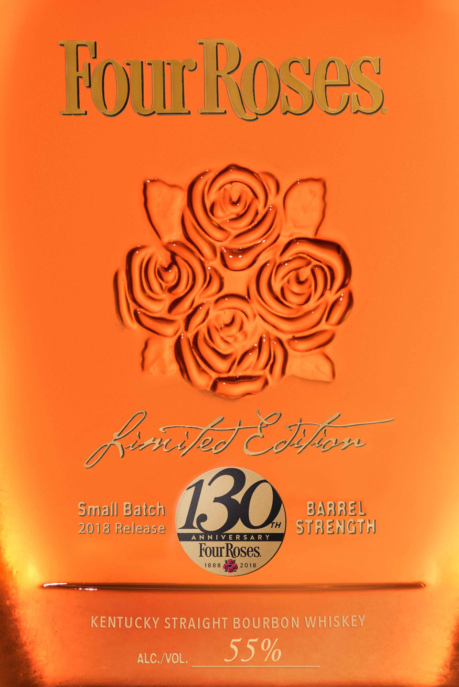
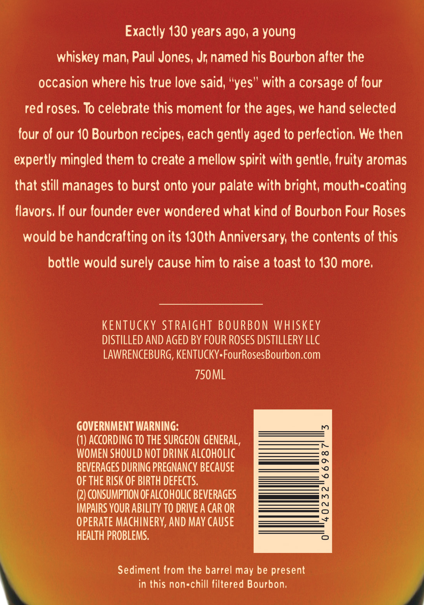
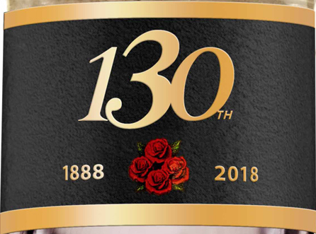

# TTB COLA Label Images - TTBID 18074001000486

**Brand Name:** FOUR ROSES

**Fanciful Name:** LIMITED EDITION 130TH ANNIVERSARY

**Issue Date:** 03/19/2018

**Origin Code:** 22

**Product Class/Type:** 101

**Source:** [TTB Public COLA Registry](https://ttbonline.gov/colasonline/viewColaDetails.do?action=publicFormDisplay&ttbid=18074001000486)

## Label Images

### Label 1

### Label 2

### Label 3

## Extracted Label Text

*Text extracted via OCR - may contain errors*

*1 image(s) excluded: text did not meet readability threshold*

**Detected Proof:** 110

### Label 1

EoicRoses
hond 8 Jpo,
Srriall Balch
130
BAAREL
2018 Release
Th
StaenGTH
NNLVER SARY
FourRoses
18 8 8
2018
KENTUCKY STRAIGHT BOURBON WHISKEY
ALC./VOL.
55%

### Label 2

Exactly 130 years ag0, a young
whiskey man; Paul Jones, Jr named his Bourbon alter the
occasion where his true love said; "yes" with a corsage ol our
red roses; To celebrate this moment lor the ages; we hand selected
four of our 10 Bourbon recipes; each gently aged to perlection; We then
expertly mingled them to create a mellow spirit with gentle; fruity aromas
that still manages to burst onto your palate with bright; mouth-coating
Ilavors; Il our lounder ever wondered what kind ol Bourbon Four Roses
would be handcrafting on its I30th Anniversary the contents ol this
bottle would surely cause him to raise a toast to 130 more;
KENTUCKY StRaight BOURBON WHSKEY
DISTILLED AND AGED BY FOUR ROSES DISTILLERY LLC
LAWRENCEBURG; KENTUCKY FourRosesBourbon.com
750ML
GOVERNMENT WARNING:
(1) ACcORDING TO THE SURGEON GENERAL,
WOMEN SHOULD NOT DRINK AlcohOLIC
BEVERAGES DURING PREGNANCY BECAUSE
8
OF THE RISK OF BIRTH DEFECTS.
(2) CONSUMPTION OFALCOHOLIC BEVERAGES
8
IMPAIRS YOUR ABILITY TO DRIVE A CAR OR
OPERATE MACHINERY, AND MAY CauSe
HEALTH PROBLEMS:
Sediment Irom the barrel may be present
in this non-chill liltered Bourbon;
