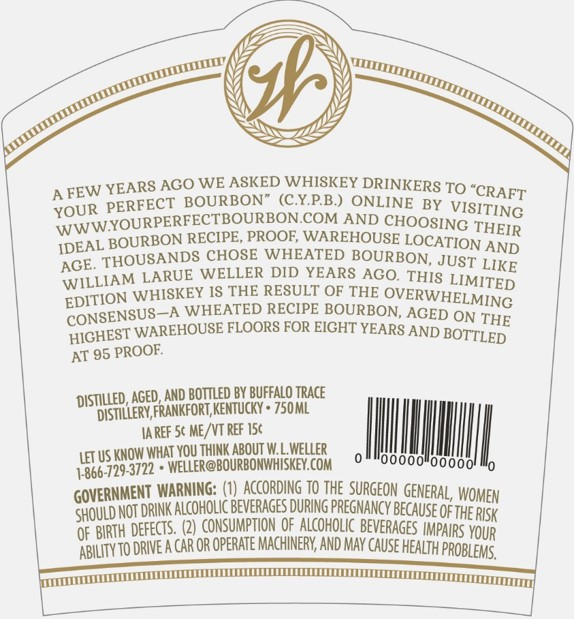

# TTB COLA Label Images - TTBID 18093001000184

**Brand Name:** WELLER

**Issue Date:** 04/05/2018

**Origin Code:** 22

**Product Class/Type:** 101

**Source:** [TTB Public COLA Registry](https://ttbonline.gov/colasonline/viewColaDetails.do?action=publicFormDisplay&ttbid=18093001000184)

## Label Images

### Back Label

### Label 1

## Extracted Label Text

*Text extracted via OCR - may contain errors*

**Detected Proof:** 95

### Back Label

FEW YEARS ACO WE ASKED WHISKEY DRINKERS TO
XOUR PERFECT BOURBONR(CYPB) ONLINE
BY
VISITING
YOWWYOURPERFECTBOURBON
COM AND
CHOOSING THEIR
IDEAL BOURBON RECIPE PROOE WAREHOUSE LOCATION AND
AGE: THOUSANDS CHOSE WHEATED BOURBON, JUST LIKE
LARUE WELLER DID YEARS ACO. THIS
WHISKEY I8 THE RESULT OF THE
OVERWHELMING
CONSENSUS_A WHEATED RECIPE BOURBON, AGED ON THE
HOCHEST WAREHOUSE FLOORS FOR EICHT YEARS AND
AT 95
 PROOF
distlleD, AGED;AND BOTVLED BY BUFFalo Trace
 distillery Frankfort Kentucky * 750 ML
Ia REF Sc ME /VT REF 156
LET US KNOW Whai YOU JHInk AbOUT MIWelleR,
14866-729-3722 * wELCER@BOURBONWHISKEY Com
oo"0oooo
GOVERNMENT WARNING: (1)caccording jo the_SURGEOM GENERAL, WOMEN
Should NoT DRINK alcohoLc beverAGES DuRIG pregnancy Because ofthE RISK
OF BURTH defects
CONSUMPTION oF Alcoholic BEvERAGes
YOUR
abilIty to dRIE A CAR OR opeRATE MachinerV AND May cause health proBlems,
"CRAFT
WILLIAM
LIMITED
EDITION
BOTTLED
IMPAIRS

### Label 1

Z2BTSN

[Z

y)

pss

y

N

sve

ne

(

s

Sao

Wo

Sp

Ny

s

= tt, en,

S&= THE ORIGINAL SS

WHEATED BOURBON

C.Y.P.B.

— eS

KENTUCKY STRAIGHT BOURBON WHISKEY

47.5% ALC BY VOL | 95 PROOF

uit

SUNT RTEOEE OEE OEE CECE rey
