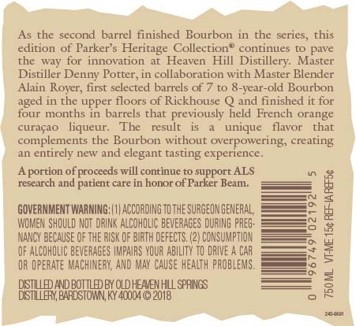
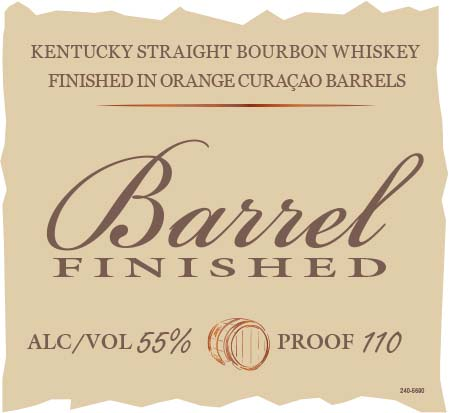

# TTB COLA Label Images - TTBID 18159001000469

**Brand Name:** PARKER'S HERITAGE COLLECTION

**Fanciful Name:** BARREL FINISHED

**Issue Date:** 06/21/2018

**Origin Code:** 22

**Product Class/Type:** 641

**Source:** [TTB Public COLA Registry](https://ttbonline.gov/colasonline/viewColaDetails.do?action=publicFormDisplay&ttbid=18159001000469)

## Label Images

### Back Label

### Front Label

### Label 2

## Extracted Label Text

*Text extracted via OCR - may contain errors*

*1 image(s) excluded: text did not meet readability threshold*

### Back Label

As the second barrel finished Bourbon in the series, this

edition of Parker’s Heritage Collection® continues to pave

the way for innovation at Heaven Hill Distillery. Master

Distiller Denny Potter, in collaboration with Master Blender

Alain Royer, first selected barrels of 7 to 8-year-old Bourbon

aged in the upper floors of Rickhouse Q and finished it for

four months in barrels that previously held French orange

curagao liqueur. The result is a unique flavor that

complements the Bourbon without overpowering, creating

an entirely new and elegant tasting experience

‘A portion of proceeds will continue to support ALS

and patient care in honor of Parker Beam.

a8

GOVERNMENT WARNING:(1) ACCORDING TOTHE SURGEON GENERAL,

=f

WOMEN SHOULD NOT DRINK ALCOHOLIC BEVERAGES DURING PREG:

NANCY BECAUSE OF THE RISK OF BIRTH DEFECTS. (2) CONSUMPTION

—=,

OF ALCOHOLIC BEVERAGES IMPAIRS YOUR ABILITY TO DRIVE A CAR

—s

&

OR OPERATE MACHINERY, x MAY CAUSE HEALTH PROBLEMS.

=

Pea

HILL

DSTLLE BRESIOIN RYARIIOZ06

sean

### Label 2

KENTUCKY STRAIGHT BOURBON WHISKEY
FINISHED IN ORANGE CURACAO BARRELS
FINISHED

ALC/VOL $5% © PROOE 770
