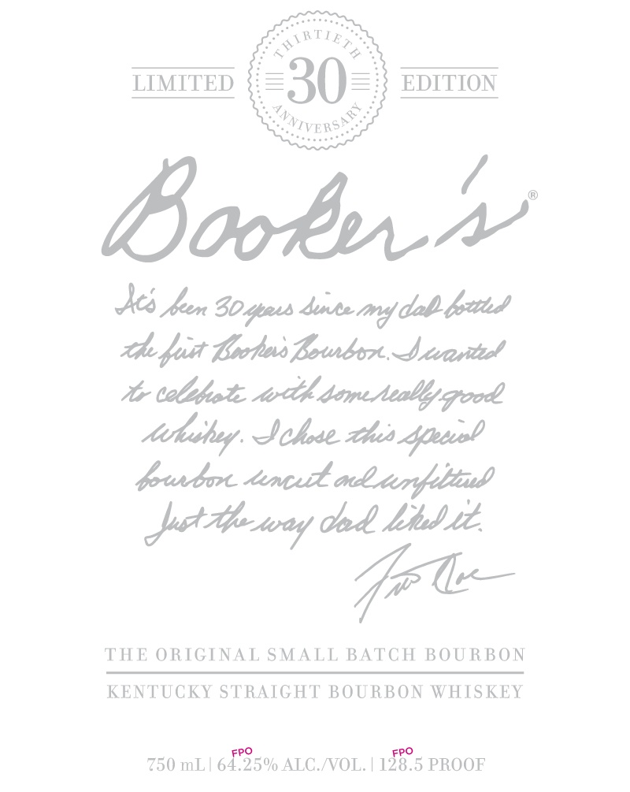
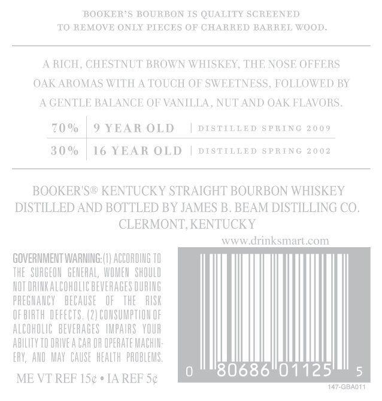

# TTB COLA Label Images - TTBID 18169001000311

**Brand Name:** BOOKER'S

**Issue Date:** 07/18/2018

**Origin Code:** 22

**Product Class/Type:** 101

**Source:** [TTB Public COLA Registry](https://ttbonline.gov/colasonline/viewColaDetails.do?action=publicFormDisplay&ttbid=18169001000311)

## Label Images

### Label 1

### Label 2

### Label 3

## Extracted Label Text

*Text extracted via OCR - may contain errors*

### Label 1

_

SORT;

LIMITED

EDITION

,

VER

seaners

/

Bookn

ithe fut Lorohus fourbor. Svarite!

We tbhate oth demise good

Achebe. Achese hes <fireuob

prurbor tomut

pA teway

Cad Ltd Ud.

fe t—

THE ORIGINAL SMALL BATCH BOURBON

KENTUCKY STRAIGHT BOURBON WHISKEY

750 mL | 6£35% ALC /VOL. | 128.5 PROOF

### Label 2

BOOKER’S BOURBON IS QUALITY SCREENED,

TO REMOVE ONLY PIECES OF CHARRED BARREL WOOD.

A RICH, CHESTNUT BROWN WHISK

Y, THE NOSE OFFERS

OAK AROMAS WITH A TOUCH OF S'

FOLLOWED BY

A GENTLE BALANCE OF VANILLA, NUT AND OAK FLAVORS.

70%

9 YEAR OLD

| DISTILLED SPRING 2009

30% 16 YEAR OLD | pistTILLEp sprine 2002

BOOKER'S® KENTUCKY STRAIGHT BOURBON WHISKEY

DISTILLED AND BOTTLED BY JAMES B. BEAM DISTILLING CO.

CLERMONT, KENTUCKY

www.drinksmart.com

GOVERNMENT WARNING:(1) ACCORDING 10

THE SURGEON GENERAL, WOMEN SHOULD

NOT DRINK ALCOHOLIC BEVERAGES DURING

PREGNANCY BECAUSE OF THE RISK

OF BIRTH DEFECTS. (2) CONSUMPTION OF

ALCOHOLIC BEVERAGES IMPAIRS YOUR

ABILITY TO DRIVEA CAR OR OPERATE MACHIN-

ERY, AND MAY CAUSE HEALTH PROBLEMS.

ME VT REF I5¢* IA REF S¢

I)

147-GBAONI
