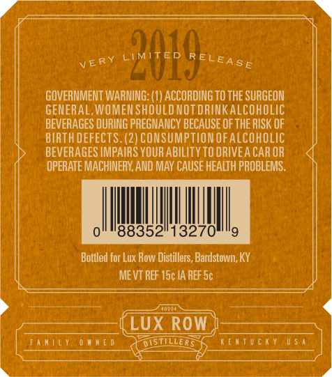
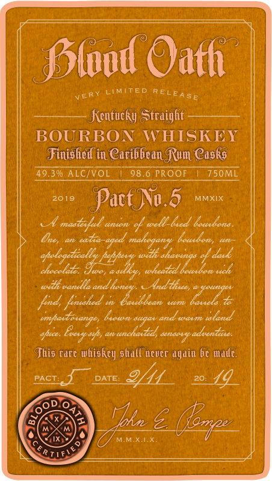
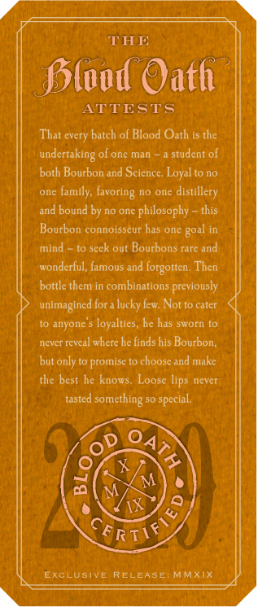

# TTB COLA Label Images - TTBID 18215001000340

**Brand Name:** BLOOD OATH

**Fanciful Name:** PACT NO. 5

**Issue Date:** 08/14/2018

**Origin Code:** 22

**Product Class/Type:** 641

**Source:** [TTB Public COLA Registry](https://ttbonline.gov/colasonline/viewColaDetails.do?action=publicFormDisplay&ttbid=18215001000340)

## Label Images

### Back Label

### Front Label

### Label 3

### Label 4

### Label 5

## Extracted Label Text

*Text extracted via OCR - may contain errors*

### Back Label

yervt

GOVERNMENT VAAN: (1) ACCORDING TO THE SURGEON

GENERAL, WOMEN SHOULDNOTDRINKALCOHOLIC

BEVERAGES DURING PREGNANCY BECAUSE OF THE RISK OF

BIRTH DEFECTS. (2) CONSUMPTION OF ALCOHOLIC

BEVERAGES IMPAIRS YOUR ABILITY TO DRIVEA CAR OR

OPERATE MACHINERY, AND MAY CAUSE HEALTH PROBLEMS.

Bottled for Lux Row Distillers, Bardstown, KY

MEVT REF 18¢ 1A REF 5¢

FAMILY OWNED

TOxt0W)

y

### Front Label

Plood Oath

very

LIMITED REL Eg gy

Kentiicky Straight

BOURBON WHISKEY

Finished in Cariibean Rum Casks

49.3% ALC/VOL | 98.6 PROOF | 750ML

2o19 Pact Nv.d Mixx

A mai

anion off woll-beed beckons.

Gon wo tio mahopang babe wa

will

si

7

chocolate: Tue, wsiliy, whaitid bo

with vandlle

And tice,

iy a's

cm

luk

snpast ange, Fowsn sagan and was iland

This rare whiskey shallnever again be mate.

Meet 7 bates

20. {4

‘ODIO.

i,

0

oa

M.M.XAX.

TEN

### Label 3

y »

THE

|

pe

i

Plood Oath

TT

STS

That every batch of Blood Oath isthe

undertaking of one man ~ a student of

both Bourbon and Science. Loyal to no

one family, favoring no one distillery

and bound by no one philosophy ~ this

Bourbon connoisseur has one goal in

mind — to seek out Bourbons rare and

wonderful, famous and forgotten. Then

Pa

bottle them in combinations previously

unimagined for alucky few. Not to cater

to anyone's loyalties, he has sworn to

never reveal where he finds his Bourbon,

but only to promise to choose and make

the best he knows. Loose lips never

tasted something so special

ov 4p

ve

CE

Riis

ExcLUSIVE RELEASE: MMXIX

### Label 4

&

MMXIX
