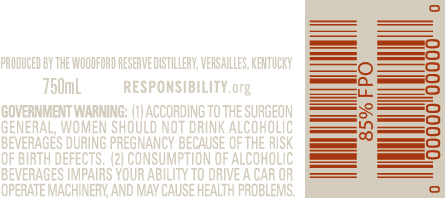
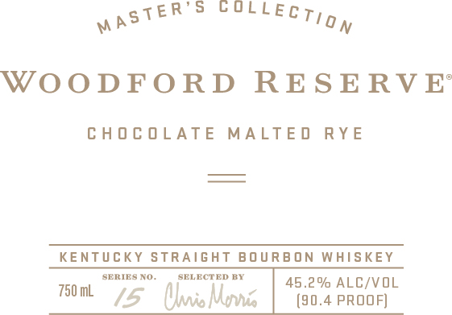
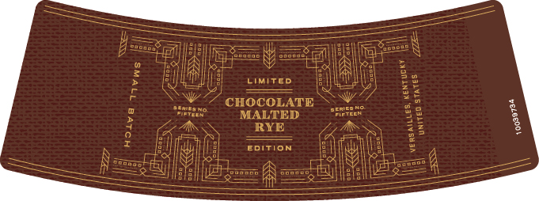

# TTB COLA Label Images - TTBID 18222001000433

**Brand Name:** WOODFORD RESERVE

**Fanciful Name:** MASTER'S COLLECTION CHOCOLATE MALTED RYE

**Issue Date:** 08/21/2018

**Origin Code:** 22

**Product Class/Type:** 101

**Source:** [TTB Public COLA Registry](https://ttbonline.gov/colasonline/viewColaDetails.do?action=publicFormDisplay&ttbid=18222001000433)

## Label Images

### Back Label

### Front Label

### Label 3

### Label 4

## Extracted Label Text

*Text extracted via OCR - may contain errors*

**Detected Proof:** 90.4

### Back Label

PRODUGED BY THE MOODFORD RESERVEDISTILLERV; VEASAILLES, KENTUCKY
'760mL
RESPOMSIBILATY org
0
GOMERMMENT UMARNING
acCoRDING TOThE SURGEON
GENERAL, WNOMEN ShOULD NOT DAINK ALCOHOLIC
BEVERAGES DURING PREGNANGY BECAUSE OfthE RISK
0F birth deFeCTS; /2i Consumption Ofalcoholic
BEVERAGES UMPAIRS VOUR ABE
TO DRIVE
Car oR
OPERATE
PROBLEMS;

### Front Label

R’S CULL
waste ECTigy
WOODFORD RESERVE’
CHOCOLATE MALTED RYE
KENTUCKY STRAIGHT BOURBON WHISKEY
sonmsxo. sauneraney | ge 296 ALG/VOL
rom 5 Olio Morne (90.4 PROOF]

### Label 3

fe a eee
fp seseee? alle (2 SY SS ee ee N
9 ala SVT
= ANI tal ait Ara 6
> UME ciwiveo EWAN) Be
cg? Gy EE
Eee aes 7 CHOCOLATE Sy treats %
ote MALTED er 88 $
4 eA RYE 15 M8 3
aces (ene a
ny te dafilig] ——eoirton aS Ss
= Namal Ni NM laces @ =
SS Hela Sess FN ses | NE Se .

### Label 4

The art of making fine whiskays first took place on the site of the

10030731

Woodford Reserve Distillery, a National Historic Landmark, in 1812.
