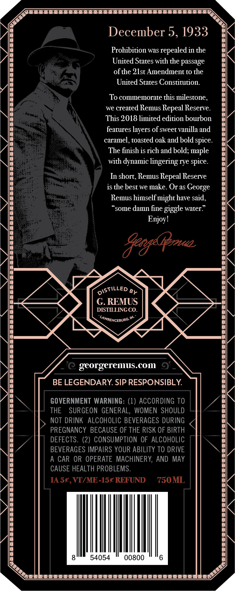
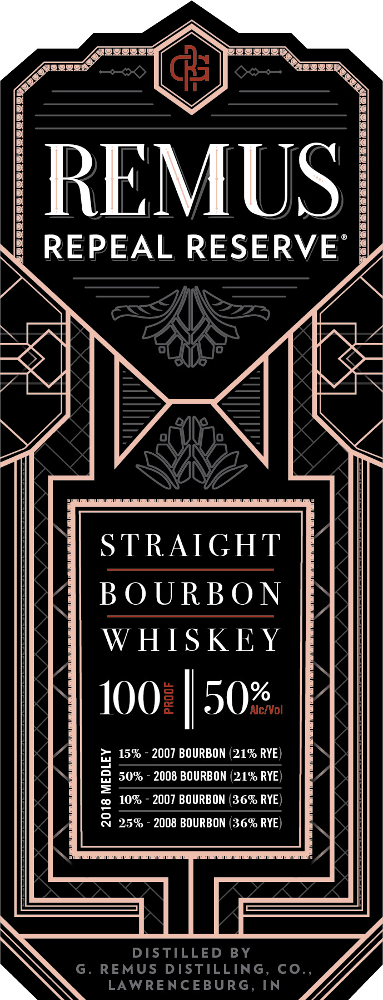
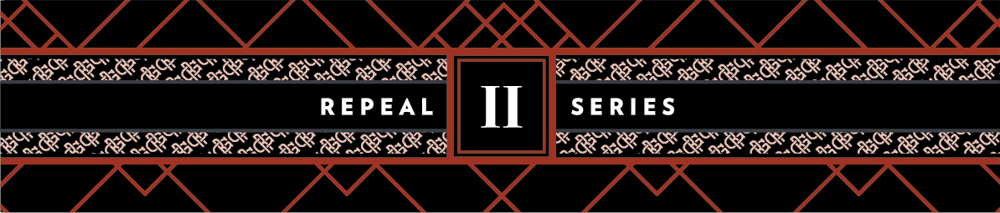

# TTB COLA Label Images - TTBID 18241001000238

**Brand Name:** REMUS

**Fanciful Name:** REPEAL RESERVE

**Issue Date:** 08/30/2018

**Origin Code:** 22

**Product Class/Type:** 101

**Source:** [TTB Public COLA Registry](https://ttbonline.gov/colasonline/viewColaDetails.do?action=publicFormDisplay&ttbid=18241001000238)

## Label Images

### Back Label

### Front Label

### Label 3

## Extracted Label Text

*Text extracted via OCR - may contain errors*

**Detected Proof:** 100

### Back Label

December 5, 1933
Prohibition was
 repealed in the
United States with the passage
ofthe 2lst Amendment to the
United States Constitution
To commemorate this milestone,
we created Remus Repeal Reserve
This 2018 limited edition bourbon
features layers of sweet vanilla and
caramel, toasted oak and bold spice
The finish is rich and bold; maple
with dynamic lingering rye spice.
In short, Remus Repeal Reserve
iS the best we make. Or as
Remus
himselfmight have said ,
'some damn fine giggle water:
Enjoyl
BeogsGeuaa
8y
G.REMUS
DISTILLINGCO
LAWRENCEBURG
georgeremus.COI
0
BE LEGENDARY SIP RESPONSIBLY:
GOVERNMENT WARNING: (1) ACCORDING TO
THE
SURGEON GENERAL, WOMEN  SHOULD
NOT DRINK   ALCOHOLIC BEVERAGES DURING
PREGNANCY  BECAUSE OF THE RISK OF BIRTH
DEFECTS. (2) CONSUMPTION OF ALCOHOLIC
BEVERAGES IMPAIRS YOUR ABILITY TO DRIVE
A CAR OR OPERATE MACHINERY, AND MAY
CAUSE HEALTH PROBLEMS
IASE,VT/ME-1sg REFUND
750ML
54054
00800
George
DISTiLLED

### Front Label

REMUS
REPEAL RESERVE
STRAIGHT
B O URB O N
WHISKEY
1002|50%
Alc/Vol
15%
2007 BOURBON (21% RYE
1
50%
2008 BOURBON (21% RYE
10%
2007 BOURBON (36% RYE
8
25%
2008 BOURBON (36% RYE)
DISTILLED
BY
G _
REMUS DISTILLING
co_
LAWRENCEBURG, IN

### Label 3

Ka
akQxQ3s
0
Qas
45
4
X
84
Cax
REPEAL
II
SERIES
XrasaksAaSKE
Xa
8*
82
