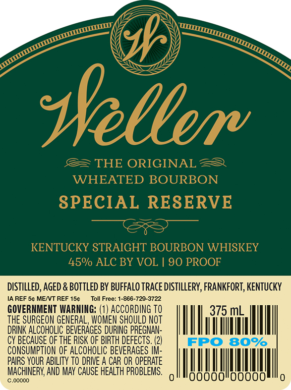

# TTB COLA Label Images - TTBID 18270001000419

**Brand Name:** WELLER

**Issue Date:** 10/15/2018

**Origin Code:** 22

**Product Class/Type:** 101

**Source:** [TTB Public COLA Registry](https://ttbonline.gov/colasonline/viewColaDetails.do?action=publicFormDisplay&ttbid=18270001000419)

## Label Images

### Label 1

## Extracted Label Text

*Text extracted via OCR - may contain errors*

### Label 1

14:

NTU

OL

PROO

DISTILLED, AGED & BOTTLED BY BUFFALO TRACE DISTILLERY, FRANKFORT, KENTUCKY

IAREF 5¢ ME/VT REF 15¢ Toll Free: 1-866-720-3722

THE SURGEON GENERAL, WOMEN SHOULD NOT

GOVERNMENT WARNING: (1) ACCORDING TO

375 mL.

DRINK ALCOHOLIC BEVERAGES DURING PREGHAN-

AM

Inn

Ill

CY BECAUSE OF THE RISK OF BIRTH DEFECTS. (2)

CONSUMPTION OF ALCOHOLIC BEVERAGES tt

PAIRS YOUR ABILITY TO DRIVE A CAR OR OPERATE

MACHINERY, AND MAY CAUSE HEALTH PROBLEMS.

|

IHN

WT

|

00000

00000
