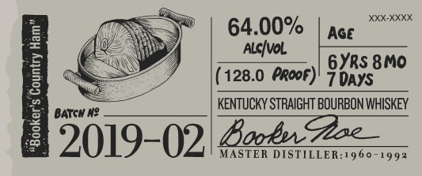
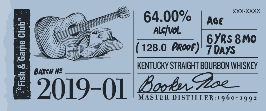
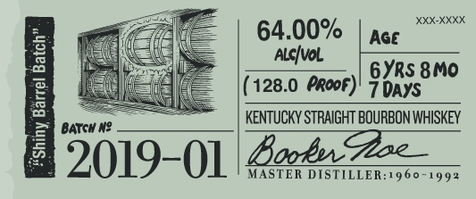
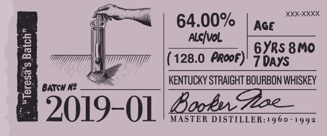
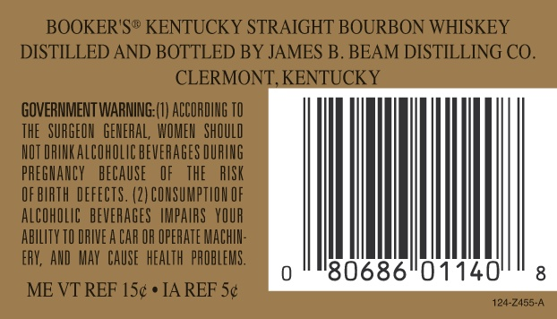

# TTB COLA Label Images - TTBID 18309001000540

**Brand Name:** BOOKER'S

**Issue Date:** 11/16/2018

**Origin Code:** 22

**Product Class/Type:** 101

**Source:** [TTB Public COLA Registry](https://ttbonline.gov/colasonline/viewColaDetails.do?action=publicFormDisplay&ttbid=18309001000540)

## Label Images

### Label 1

### Label 2

### Label 3

### Label 4

### Label 5

### Label 6

### Label 7

## Extracted Label Text

*Text extracted via OCR - may contain errors*

### Label 1

booker

Bho Wibuy tm shea frchege Ae

(es

mila

Satta sper tds ur fll

Wy rm o lin Loan bh his

eee, || == |

PEN LES epens

s<¢e

barrel tured.

cened jlo .

### Label 2

64.00%

(128.0 PRooF PROOF)

it we

Boob STRAIGHT BOURBON WHISKEY

5019- 02 Looker: DISTILLER:1960-1993

### Label 3

64.00%

(128.0 PRooF PRooF)

7 aid

Boob: STRAIGHT BOURBON WHISKEY

9019- Ol food: DISTILLER:1960-1993

### Label 4

ife|

64.00%

{

ia

(128.0 ArooF)

7DAYS

KENTUCKY STRAIGHT BOURBON WHISKEY

9019-01 4-4-2

### Label 5

64.00%

(128.0 PRooF PROOF)

7 aid

Boob STRAIGHT BOURBON WHISKEY

9019- Ol Lack: DISTILLER:1960-1993

### Label 6

l

80686'01140'

### Label 7

»—~
