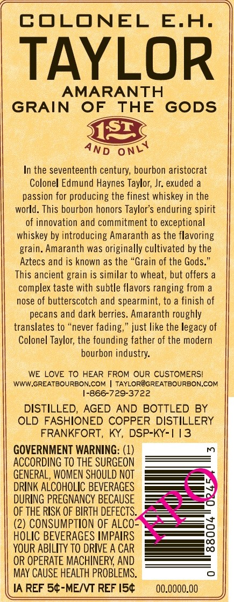
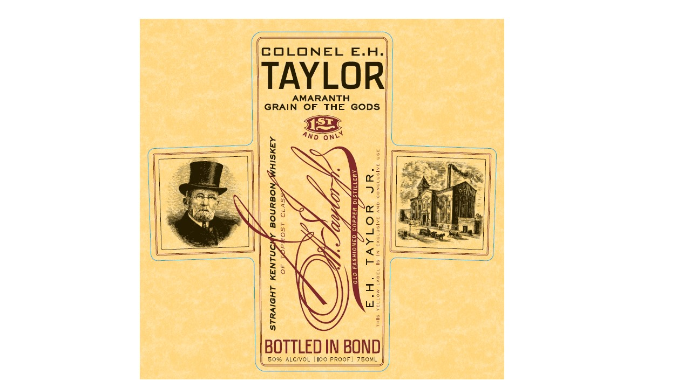

# TTB COLA Label Images - TTBID 19032001000402

**Brand Name:** COLONEL E.H. TAYLOR

**Issue Date:** 02/19/2019

**Origin Code:** 22

**Product Class/Type:** 101

**Source:** [TTB Public COLA Registry](https://ttbonline.gov/colasonline/viewColaDetails.do?action=publicFormDisplay&ttbid=19032001000402)

## Label Images

### Back Label

### Front Label

## Extracted Label Text

*Text extracted via OCR - may contain errors*

### Back Label

COLONEL E.H.

TAYLOR

AMARANTH

GRAIN OF THE GODS

4nd onv

In the seventeenth century, bourbon aristocrat

Colonel Edmund Haynes Taylor, Jr. exuded a

passion for producing the finest whiskey in the

world. This bourbon honors Taylor’s enduring spirit

of innovation and commitment to exceptional

whiskey by introducing Amaranth as the flavoring

grain. Amaranth was originally cultivated by the

Aztecs and is known as the “Grain of the Gods.”

This ancient grain is similar to wheat, but offers a

complex taste with subtle flavors ranging from a

nose of butterscotch and spearmint, to a finish of

pecans and dark berries. Amaranth roughly

translates to “never fading,” just like the legacy of

Colonel Taylor, the founding father of the modern

bourbon industry.

WE LOVE TO HEAR FROM OUR CUSTOMERS!

WWW,GREATBOURBON.COM | TAYLOR@GREATBOURBON.COM

1-866-729-3722

DISTILLED, AGED AND BOTTLED BY

OLD FASHIONED COPPER DISTILLERY

FRANKFORT, KY, DSP-KY-1 13

ial

GOVERNMENT WARNING: (1)

ACCORDING TO THE SURGEON

GENERAL, WOMEN SHOULD NOT

DRINK ALCOHOLIC BEVERAGES

DURING PREGNANCY BECAUSE

OF THE RISK OF BIRTH DEFECTS.

(2) CONSUMPTION OF ALCO=

HOLIC BEVERAGES IMPAIRS

YOUR ABILITY TO DRIVE A CAR

OR OPERATE MACHINERY, AND

MAY CAUSE HEALTH PROBLEMS.

IA REF 5¢-ME/VT REF I5¢

00.0000.00

### Front Label

==

COLONEL E.H

TAYLOR

GRAIN see GODS

4ND one

————

|

SX

ae,

a<

ay

30

$s

AN

a=

Se

|

——_—_—

\>-

J

———

Wo

zu

(X

[Me

BOTTLED IN BOND)

50% ALCIVOL {100 PROOF! 750ML
