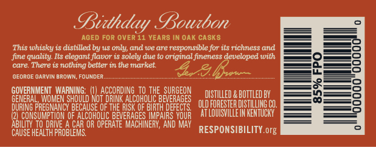
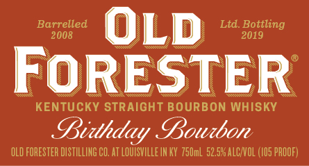
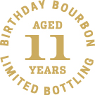
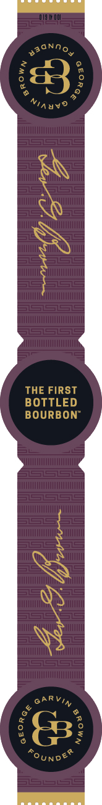
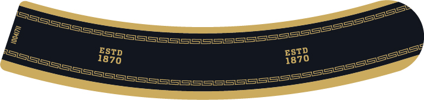

# TTB COLA Label Images - TTBID 19056001001102

**Brand Name:** OLD FORESTER

**Fanciful Name:** BIRTHDAY BOURBON 2019

**Issue Date:** 03/06/2019

**Origin Code:** 22

**Product Class/Type:** 101

**Source:** [TTB Public COLA Registry](https://ttbonline.gov/colasonline/viewColaDetails.do?action=publicFormDisplay&ttbid=19056001001102)

## Label Images

### Back Label

### Label 1

### Label 2

### Label 4

### Label 5

## Extracted Label Text

*Text extracted via OCR - may contain errors*

### Back Label

Didhday Poucbon

AGED FOR OVER11 YEARS IN OAK CASKS

‘This whisky is distilled by us only, and we are responsible for its richness and

Jine quality. Its elegant flavor is solely due to original fineness developed with

‘care. There is nothing better in the market,

‘GEORGE OARVIN BROWN, FOUNDER.

7 a

GOVERNMENT WARNING: (I) ACCORDING TO THE SURGEON

DISTILLED & BOTTLED BY

GENERAL

DRINK ALC ae foe

STER DISTILLING CO.

DURING PREGNANCY BECAUSE OF THE RISK OF

P| COSUNPHGN OF ALCONOUC EVeAceS Means Yon ATOUSYILEN ENTRY

ILITY.

DRIVE A CAR OR OPERATE MACHINERY, AND MAY

CAUSE HEALTH PROBLE!

RESPONSIBILITY org

### Label 1

Barrelled

Ltd. Bottling

©

RE

'STER

a

ke ee

ae eA.

KEN. UCKY STRAIGHT BOURBON WHISKY

Disthday Poubon

OLD FORESTER DISTILLING GO. AT LOUISVILLEIN KY 750mL 52.5% ALO/VOL (105 PROOF)

### Label 2

RY 30g,

AGED

11:

%, YEARS =

"Sy aot’

### Label 4

Tapes Ne teat asa

j

|

ene weer
