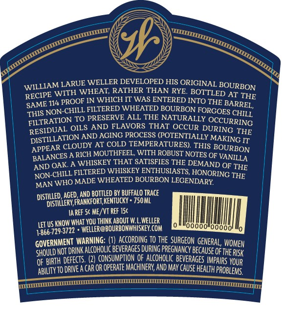
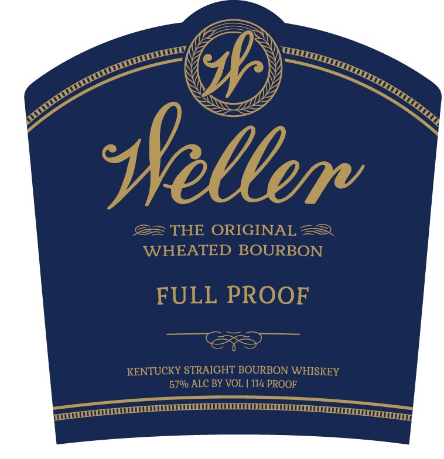

# TTB COLA Label Images - TTBID 19057001000673

**Brand Name:** WELLER

**Issue Date:** 03/07/2019

**Origin Code:** 22

**Product Class/Type:** 101

**Source:** [TTB Public COLA Registry](https://ttbonline.gov/colasonline/viewColaDetails.do?action=publicFormDisplay&ttbid=19057001000673)

## Label Images

### Back Label

### Label 1

## Extracted Label Text

*Text extracted via OCR - may contain errors*

**Detected Proof:** 114

### Back Label

WILLIAM LARUE WELLER DEVELOPED HIS ORIGINAL
WITH WHEAT; RATHER THAN RYE BOTTLED AT
114 PROOF IN WHICH IT WAS ENTERED INTO THE
THE
NON-CHILL FILTERED WHEATED BOURBON FORGOES
FILTRATION TO PRESERVE
ALL THE NATURALLY
OCCURRING
OILS AND FLAVORS THAT OCCUR DURING
RESIDUATION AND ACING PROCESS POTENTIALLY MANCNG HTF
APPEAR CLOUDY AT COLD TEMPERATURES) THIS
BALANCES A RICH MOUTHFEEL, WITH ROBUST NOTES OF
WHISKEY THAT SATISFIES THE DEMAND OF THE
NON-
FILTERED WHISKEY ENTHUSIASTS, HONORING THE
WHO
WHEATED BOURBON LECENDARY
dIstiLLed; AGED,AND BOTTLED BY BUFFALO TRAce
DiStillery,frankforT KeNTucKy
750ML
IA REF Sc ME /VT REF 15c
LET US KNOW WHAt you Thinp ABout W
WELLER
729,3722 * WELLER@BOURBONWHISKEY CoM
0oo0 0odod
1-866
GOVERNMENT WARNING: (2)CHccoRDING %o ThecSURGEON GENERAL WOMEN
SHould NoT DrINk alcoholic BEVERAGES DURING preGnancy Because OftheRISk
OF BiRTH defects  (2) ConSeuMptIo QF ercoholc Beverages mpars Vour
DRIE A CaR OR operate machinery AND May cause HEalth PRoblems
uuum
BOURBON
RECIPE
BARREL ,
SAME
THIS
CHILL
RESIDUAL
BOURBON
VANILLA
OAK
AND
CHILL
MADE -
MAN
ABILITY TO

### Label 1

sellerv
THE ORIGINAL
WHEATED BOURBON
FULL PROOF
KENTUCKY STRAIGHT BOURBON WHISKEY
570/ ALC BY VOL | 114 PROOF
