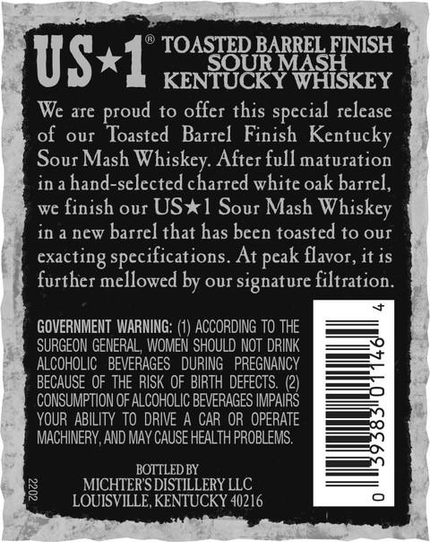
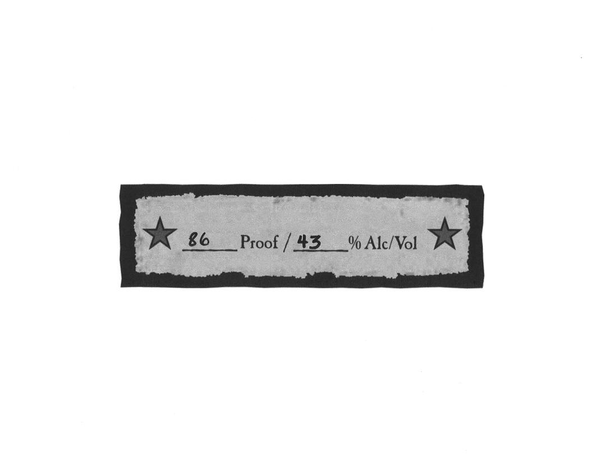
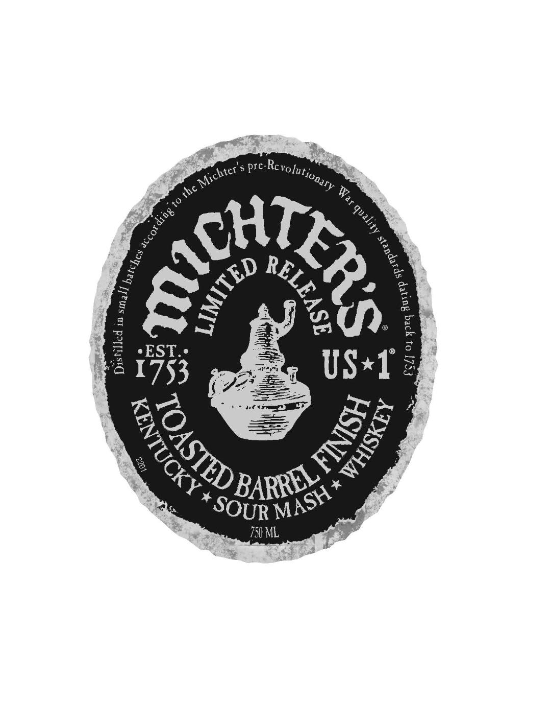
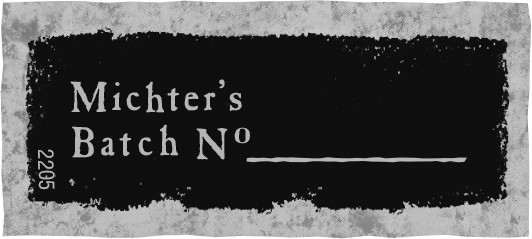
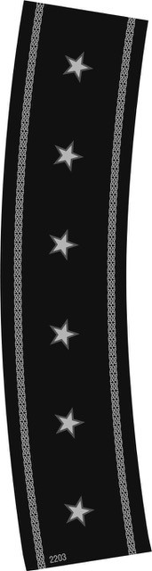
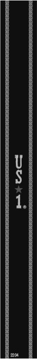

# TTB COLA Label Images - TTBID 19071001000680

**Brand Name:** MICHTER'S

**Fanciful Name:** TOASTED BARREL FINISH

**Issue Date:** 04/10/2019

**Origin Code:** 22

**Product Class/Type:** 140

**Source:** [TTB Public COLA Registry](https://ttbonline.gov/colasonline/viewColaDetails.do?action=publicFormDisplay&ttbid=19071001000680)

## Label Images

### Back Label

### Front Label

### Label 1

### Label 3

### Label 5

### Label 6

## Extracted Label Text

*Text extracted via OCR - may contain errors*

*4 image(s) excluded: text did not meet readability threshold*

### Back Label

TOASTED BARREL FINISH
US*1
SOUR MASH
KENTUCKY WHISKEY
We are
to offer this
release
of
our  Toasted Barrel Finish Kentucky
Sour Mash Whiskey: After fullmaturation
in a hand-selected charred white oak barrel,
we finish our US*1 Sour Mash
Whiskey
in a new barrel that has been toasted to our
exacting specifications. At
flavor, it is
further mellowed by our signature filtration_
GOVERNMENT WARNING: (1) ACCORDING to THE
SURGEON GENERAL, WOMEN SHOULD NOT DRINK
ALCOHOLIC  BEVERAGES   DURING
PREGNANCY
BECAUSE OF THE RISK OF BIRTH DEFECTS
CONSUMPTION OF ALCOHOLIC BEVERAGES IMPAIRS
YOUR   ABILITY to DRIVE A CAR OR OPERATE
MACHINERY,AND May CAUSE HEAlTH PROBLEMS .
BOTTLED BY
8
MICHTERSDISTILLERY LLC
LOUISVILLE, KENTUCKY 40216
proud
special
pcak

### Label 5

ae

ree

ep
Saal

* * * a * *

a aot
oe TEE
litnttenneensas eee
