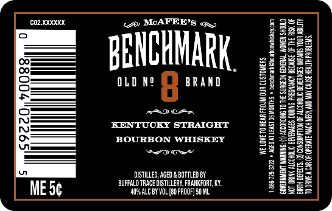

# TTB COLA Label Images - TTBID 19079001000525

**Brand Name:** BENCHMARK

**Issue Date:** 03/26/2019

**Origin Code:** 22

**Product Class/Type:** 101

**Source:** [TTB Public COLA Registry](https://ttbonline.gov/colasonline/viewColaDetails.do?action=publicFormDisplay&ttbid=19079001000525)

## Label Images

### Front Label

## Extracted Label Text

*Text extracted via OCR - may contain errors*

### Front Label

(C02.XKKKK

Qs

«7 MCAFEER’s a,

25

23

25

td

a=

BENCHMARK.

gs

56

OLD Ne 8 BRAND

3.

=:

Fabs

gs

ae

32

ROA

KENTUCKY STRAIGHT

Bye

BOURBON WHISKEY

ge

23

a6

Ei

3

kod

#8

Ss

Be

gs

DISTILLED, AGED & BOTTLED BY

Zz

B=

ZeS

BUFFALO TRACE DISTILLERY, FRANKFORT, KY.

22

ses

MES¢

‘ALC BY VOL [8 PROOF] 50 ML

SES
